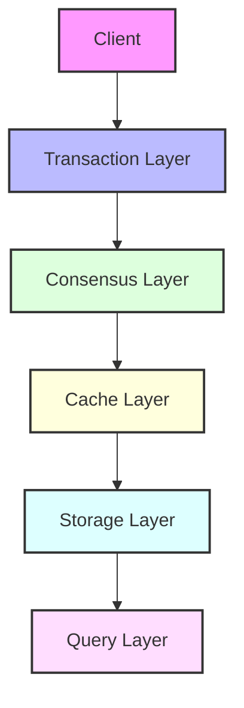

<div align="center">

# 🚀 Rustorium

**Next-Generation Ultra-Low Latency Distributed Blockchain Platform**

[](https://opensource.org/licenses/MIT)
[](https://www.rust-lang.org)
[](https://github.com/enablerdao/rustorium/actions)
[](https://docs.rustorium.dev)
[](https://discord.gg/rustorium)

[English](README.en.md) | [中文](README.zh.md) | [日本語](README.md)


[📚 Documentation](docs/) | [🌍 Demo](https://demo.rustorium.dev) | [💬 Discord](https://discord.gg/rustorium)

</div>

---

## 💫 Features

Rustorium is a high-performance blockchain platform that enables next-generation distributed infrastructure.

### ⚡️ Ultra-Low Latency

- **100K+ TPS**: Industry-leading transaction processing capability
- **< 100ms Latency**: Ideal for real-time applications
- **QUIC + Redpanda**: Latest network/streaming technology

### 🌍 Geo-Distribution

- **Global Distribution**: Optimal processing across worldwide nodes
- **Dynamic Sharding**: Automatic distribution based on load
- **Edge Computing**: Processing at nodes closest to users

### 🔒 High Reliability

- **ZK Proofs**: Mathematical correctness guarantees
- **Verkle Trees**: Efficient state management
- **Byzantine Fault Tolerance**: High fault tolerance

### 🤖 Self-Optimization

- **AI Optimization**: Continuous performance improvement
- **Predictive Scaling**: Automatic scaling based on load prediction
- **Auto Fault Detection/Recovery**: System robustness

## 🎯 Use Cases

| Domain | Features | Use Cases |
|--------|----------|-----------|
| 🏦 DeFi | Ultra-fast Transaction Processing | - DEX<br>- Lending<br>- Derivatives |
| 🎮 GameFi | Real-time Synchronization | - MMO/RPG<br>- NFT Games<br>- Metaverse |
| 👥 SocialFi | Global Distribution | - Social Networks<br>- Communities<br>- Content Distribution |
| 📊 DataFi | Large-scale Data Processing | - Data Markets<br>- Analytics<br>- AI Training |

## 🚀 Quick Start

```bash
# Installation
curl -sSf https://raw.githubusercontent.com/enablerdao/rustorium/main/scripts/install.sh | bash

# Start in development mode
rustorium --dev

# Start in production mode
rustorium --config config.toml
```

## 🏗 Architecture



### Core Technologies

| Layer | Technology | Features |
|-------|------------|----------|
| 🌐 Network | [QUIC] | Ultra-low latency P2P |
| 📦 Transaction | [Redpanda] | Geo-distributed processing |
| 🤝 Consensus | [Gluon] | Fast distributed consensus |
| 💾 Cache | [Noria] | Real-time caching |
| 📚 Storage | [TiKV] + [Redb] | High-performance KV store |
| ✅ Verification | [Poseidon] | ZK-friendly hashing |

## 📊 Performance

### Transaction Processing Capability

| Scenario | TPS | Latency | Description |
|----------|-----|----------|-------------|
| Normal Load | 50K+ | < 50ms | 1KB tx, 500 parallel |
| High Load | 100K+ | < 100ms | 1KB tx, 1000 parallel |
| Extreme Test | 200K+ | < 200ms | 1KB tx, 2000 parallel |

### Global Processing

- **🚄 Intra-Region**: < 100ms
- **🌍 Inter-Region**: < 2s
- **🔄 Replication**: Immediate (async)

## 🛠 For Developers

### Requirements

- Rust 1.75.0+
- CMake 3.20+
- OpenSSL 1.1+

### Documentation

- [Architecture](docs/architecture/README.md)
- [API Reference](docs/api/README.md)
- [Development Guide](docs/guides/development.md)
- [Operations Guide](docs/guides/operations.md)

### Code Examples

```rust
// Transaction processing
let tx = Transaction::new()
    .with_data(data)
    .with_location(location)
    .build()?;

let receipt = client.submit_transaction(tx).await?;

// Stream processing
let mut stream = client.subscribe_to_events().await?;

while let Some(event) = stream.next().await {
    match event {
        Event::NewBlock(block) => {
            println!("New block: {}", block.height);
        }
        Event::StateUpdate(update) => {
            println!("State update: {:?}", update);
        }
    }
}
```

## 🤝 Contributing

We welcome contributions to the project!

- [Contribution Guide](CONTRIBUTING.md)
- [Coding Standards](docs/coding-standards.md)
- [Roadmap](docs/roadmap.md)

## 📄 License

This project is licensed under the MIT License - see the [LICENSE](LICENSE) file for details.

---

<div align="center">

**[🌟 Star](https://github.com/enablerdao/rustorium)** | **[🐛 Report Issues](https://github.com/enablerdao/rustorium/issues)** | **[💬 Join Discord](https://discord.gg/rustorium)**

</div>

[QUIC]: https://www.chromium.org/quic/
[Redpanda]: https://redpanda.com/
[Gluon]: https://gluon.rs/
[Noria]: https://github.com/mit-pdos/noria
[TiKV]: https://tikv.org/
[Redb]: https://redb.org/
[Poseidon]: https://www.poseidon-hash.info/
