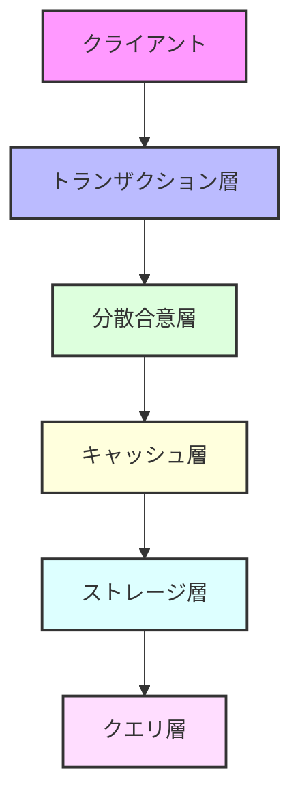

<div align="center">

# 🚀 Rustorium

**超低遅延・地理分散型ブロックチェーンプラットフォーム**

[](https://opensource.org/licenses/MIT)
[](https://www.rust-lang.org)
[](https://github.com/enablerdao/rustorium/actions)
[](https://docs.rustorium.dev)
[](https://discord.gg/rustorium)

[English](README.en.md) | [中文](README.zh.md) | 日本語

<br>


<br>

[📚 ドキュメント](docs/) | [🌍 デモ](https://demo.rustorium.dev) | [💬 Discord](https://discord.gg/rustorium)

</div>

---

## 💫 概要

Rustoriumは、次世代の分散型インフラストラクチャを実現する高性能ブロックチェーンプラットフォームです。

- **⚡️ 超低遅延**: 100K+ TPS、レイテンシ < 100ms
- **🌍 地理分散**: 世界中のノードで最適な処理を実現
- **🔒 高い信頼性**: ZK証明による検証可能性
- **🤖 自己最適化**: AIによる自動パフォーマンスチューニング

## 🎯 ユースケース

| 分野 | 特徴 | ユースケース |
|------|------|------------|
| 🏦 DeFi | 超高速取引処理 | - 分散型取引所<br>- レンディング<br>- デリバティブ |
| 🎮 GameFi | リアルタイム同期 | - MMO/RPG<br>- NFTゲーム<br>- メタバース |
| 👥 SocialFi | グローバル分散 | - SNS<br>- コミュニティ<br>- コンテンツ流通 |
| 📊 DataFi | 大規模データ処理 | - データマーケット<br>- 分析基盤<br>- AI学習 |

## 🚀 クイックスタート

```bash
# インストール
curl -sSf https://raw.githubusercontent.com/enablerdao/rustorium/main/scripts/install.sh | bash

# 開発モードで起動
rustorium --dev

# 本番モードで起動
rustorium --config config.toml
```

## 🏗 アーキテクチャ



### コアテクノロジー

| レイヤー | 技術 | 特徴 |
|---------|------|------|
| 🌐 ネットワーク | [QUIC] | 超低遅延P2P通信 |
| 📦 トランザクション | [Redpanda] | 地理分散処理 |
| 🤝 合意形成 | [Gluon] | 高速分散合意 |
| 💾 キャッシュ | [Noria] | リアルタイムキャッシュ |
| 📚 ストレージ | [TiKV] + [Redb] | 高性能分散KVストア |
| ✅ 検証 | [Poseidon] | ZKフレンドリーハッシュ |

## 📊 パフォーマンス

### トランザクション処理能力

| シナリオ | TPS | レイテンシ | 説明 |
|---------|-----|------------|------|
| 通常負荷 | 50K+ | < 50ms | 1KB取引、500並列 |
| 高負荷 | 100K+ | < 100ms | 1KB取引、1000並列 |
| 極限テスト | 200K+ | < 200ms | 1KB取引、2000並列 |

### グローバル処理

- **🚄 リージョン内**: < 100ms
- **🌍 リージョン間**: < 2s
- **🔄 レプリケーション**: 即時（非同期）

## 🛠 開発者向け

### 必要要件

- Rust 1.75.0+
- CMake 3.20+
- OpenSSL 1.1+

### ドキュメント

- [アーキテクチャ](docs/architecture/README.md)
- [API リファレンス](docs/api/README.md)
- [開発ガイド](docs/guides/development.md)
- [運用ガイド](docs/guides/operations.md)

### コード例

```rust
// トランザクション処理
let tx = Transaction::new()
    .with_data(data)
    .with_location(location)
    .build()?;

let receipt = client.submit_transaction(tx).await?;

// ストリーム処理
let mut stream = client.subscribe_to_events().await?;

while let Some(event) = stream.next().await {
    match event {
        Event::NewBlock(block) => {
            println!("New block: {}", block.height);
        }
        Event::StateUpdate(update) => {
            println!("State update: {:?}", update);
        }
    }
}
```

## 🤝 コントリビューション

プロジェクトへの貢献を歓迎します！

- [コントリビューションガイド](CONTRIBUTING.md)
- [コーディング規約](docs/coding-standards.md)
- [ロードマップ](docs/roadmap.md)

## 📄 ライセンス

このプロジェクトはMITライセンスで提供されています。詳細は[LICENSE](LICENSE)ファイルをご覧ください。

---

<div align="center">

**[🌟 スターをつける](https://github.com/enablerdao/rustorium)** | **[🐛 Issue報告](https://github.com/enablerdao/rustorium/issues)** | **[💬 Discord参加](https://discord.gg/rustorium)**

</div>

[QUIC]: https://www.chromium.org/quic/
[Redpanda]: https://redpanda.com/
[Gluon]: https://gluon.rs/
[Noria]: https://github.com/mit-pdos/noria
[TiKV]: https://tikv.org/
[Redb]: https://redb.org/
[Poseidon]: https://www.poseidon-hash.info/
