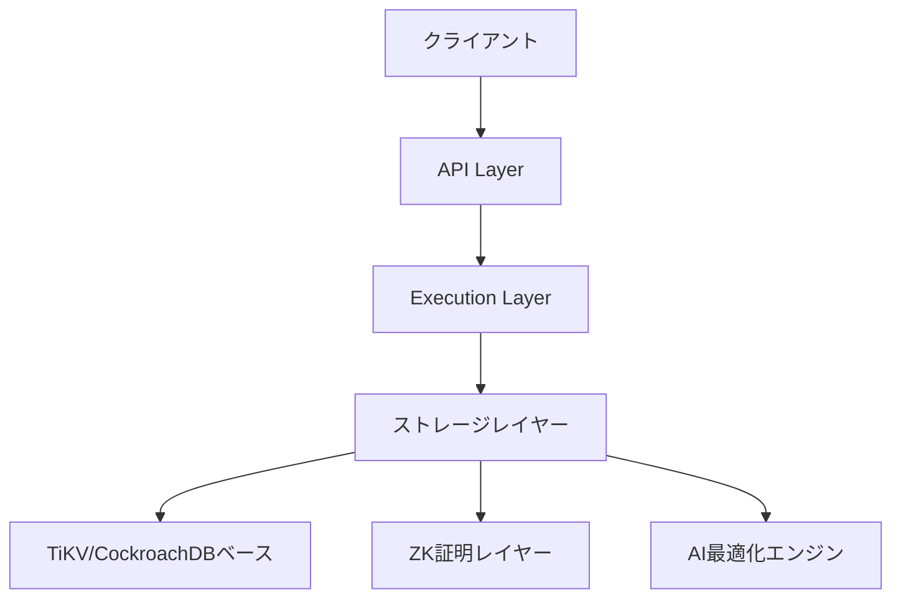

# 🚀 Rustorium

<div align="center">

**次世代の自己最適化型ブロックチェーンプラットフォーム**

[](https://opensource.org/licenses/MIT)

</div>

---

## 💫 Rustoriumとは

Rustoriumは、革新的な分散型ストレージ、ZK証明、AI自己最適化を統合した次世代のブロックチェーンプラットフォームです。TiKV/CockroachDBベースの高性能ストレージエンジンと、最先端のZK技術を組み合わせることで、unprecedented（前例のない）レベルのスケーラビリティと検証可能性を実現します。

### 🌟 革新的な特徴

#### 🗄️ 分散ストレージエンジン
- **TiKV/CockroachDBベース**: グローバルスケールの分散KVストア
- **Redbによる高速化**: 最適化されたストレージレイヤー
- **Geo分散アーキテクチャ**: マルチリージョン対応
- **ZKフレンドリー**: Poseidonハッシュベースのデータ構造

#### 🔐 ZKプルーフシステム
- **Halo2/Plonky2**: 高速なZK証明生成
- **Poseidonハッシュ**: ZK最適化されたハッシュ関数
- **検証可能性**: すべての操作の証明生成

#### 🤖 AI自己最適化
- **自動負荷分散**: AIベースのシャーディング最適化
- **予測的障害検知**: 問題発生前の自動対応
- **パフォーマンス最適化**: リアルタイムチューニング

#### ⚡️ ハイパフォーマンス
- **Narwhal & Bullshark**: 高速なコンセンサス
- **QUICベース通信**: 効率的なP2Pプロトコル
- **非同期処理**: Tokioベースの並列実行

## 🚀 クイックスタート

### 📦 インストール
```bash
curl -sSf https://raw.githubusercontent.com/enablerdao/rustorium/main/scripts/install.sh | bash
```

### 🎮 基本コマンド
```bash
# ノードの起動
rustorium start

# システム状態の確認
rustorium status

# パフォーマンスモニタリング
rustorium monitor

# Geo分散設定
rustorium geo configure

# ZK証明の検証
rustorium verify-proof <proof-id>

# AI最適化の状態確認
rustorium ai-status
```

## 🔧 アーキテクチャ

### 📊 コアコンポーネント



### 🛠 技術スタック
- **言語**: Rust
- **ストレージ**: TiKV/CockroachDBベース + Redb
- **ZK証明**: Halo2/Plonky2
- **コンセンサス**: Narwhal & Bullshark
- **P2P**: QUICベース通信
- **非同期処理**: Tokio
- **AI最適化**: カスタムML実装

## 📚 詳細ドキュメント

### 🎓 コンセプト
- [アーキテクチャ概要](docs/architecture/overview.md)
- [分散ストレージ設計](docs/architecture/storage.md)
- [ZK証明システム](docs/architecture/zk-proofs.md)
- [AI自己最適化](docs/architecture/ai-optimization.md)

### 👨‍💻 開発者向け
- [ローカル開発環境](docs/guides/local-dev.md)
- [APIリファレンス](docs/api/reference.md)
- [コントリビューション](CONTRIBUTING.md)

### 📖 運用ガイド
- [デプロイメント](docs/operations/deployment.md)
- [モニタリング](docs/operations/monitoring.md)
- [トラブルシューティング](docs/operations/troubleshooting.md)

## 🛠 開発環境のセットアップ

### 必要要件
- Rust 1.75.0+
- CMake 3.20+
- OpenSSL 1.1+

### ビルド手順
```bash
# リポジトリのクローン
git clone https://github.com/enablerdao/rustorium.git
cd rustorium

# 依存関係のインストール
cargo build

# テストの実行
cargo test

# 開発用ノードの起動
cargo run -- --dev
```

## 📜 ライセンス

Rustoriumは[MITライセンス](LICENSE)の下で公開されています。

---

<div align="center">

**[🌟 GitHubでスターを付ける](https://github.com/rustorium/rustorium)**

</div>