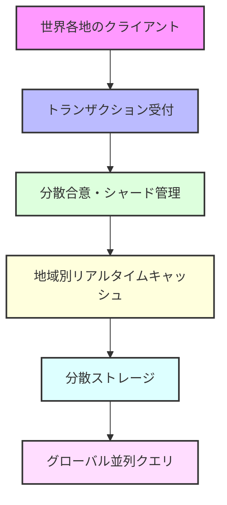
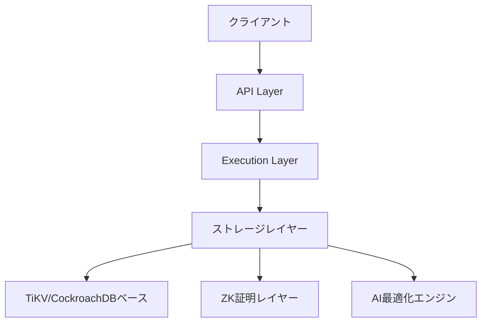

# 🚀 Rustorium

<div align="center">

**超低遅延・地理分散型ブロックチェーンプラットフォーム**

[](https://opensource.org/licenses/MIT)

</div>

## 🌟 アーキテクチャ概要



### 🔥 主要コンポーネント

#### 1️⃣ トランザクション受付レイヤー
- **Redpandaベース**: 超低遅延シャーディング
- **地理的最適化**: クライアント位置に基づくルーティング
- **自動負荷分散**: リアルタイムな負荷監視と調整

#### 2️⃣ 分散合意レイヤー
- **Gluonベース**: 高性能なRaftプロトコル
- **Geo-Zones**: 地理的に最適化された合意形成
- **動的シャーディング**: 負荷に応じた自動再配置

#### 3️⃣ キャッシュレイヤー
- **Noriaベース**: リアルタイムキャッシュ
- **グローバル分散**: 世界各地にノード配置
- **フロー最適化**: アクセスパターンに基づく自動最適化

#### 4️⃣ ストレージレイヤー
- **TiKV + Redb**: 高性能分散KVストア
- **Poseidonハッシュ**: ZKフレンドリーなVerkle Trees
- **地理的レプリケーション**: データの最適配置

#### 5️⃣ P2Pネットワーク
- **QUICベース**: 超高速なP2P通信
- **自動証明書管理**: セキュアな通信
- **双方向ストリーム**: 効率的なデータ転送

---

## 🚀 クイックスタート

### 📦 インストール
```bash
curl -sSf https://raw.githubusercontent.com/enablerdao/rustorium/main/scripts/install.sh | bash
```

### 🎮 基本的な使用方法
```bash
# ノードの起動（地域を指定）
rustorium start --region asia-northeast

# ステータス確認
rustorium status

# メトリクス監視
rustorium monitor

# シャード情報の確認
rustorium shards list

# キャッシュ最適化の実行
rustorium cache optimize
```

## 📊 パフォーマンス特性

### トランザクション処理
- **スループット**: 100,000+ TPS（地域内）
- **レイテンシ**: < 100ms（地域内）
- **グローバル確定**: < 2s

### ストレージ
- **容量**: ペタバイトスケール
- **クエリレイテンシ**: < 10ms（キャッシュヒット時）
- **レプリケーション**: 非同期（即時）/ 同期（選択可）

### キャッシュ
- **ヒット率**: 95%+（最適化後）
- **更新伝播**: < 50ms
- **メモリ使用**: 設定可能（ノードごと）

## 🛠 開発者向け情報

### 必要要件
- Rust 1.75.0+
- CMake 3.20+
- OpenSSL 1.1+

### ローカル開発環境のセットアップ
```bash
# リポジトリのクローン
git clone https://github.com/enablerdao/rustorium.git
cd rustorium

# 依存関係のインストール
cargo build

# テストの実行
cargo test

# 開発用ノードの起動（シングルノード）
cargo run -- --dev
```

### アーキテクチャドキュメント
- [システム設計](docs/architecture/overview.md)
- [トランザクション処理](docs/architecture/transaction.md)
- [分散合意](docs/architecture/consensus.md)
- [キャッシュ最適化](docs/architecture/cache.md)
- [ストレージ](docs/architecture/storage.md)
- [P2Pネットワーク](docs/architecture/network.md)

## 📈 運用ガイド

### モニタリング
- Prometheusエクスポーター内蔵
- Grafanaダッシュボード提供
- アラート設定可能

### バックアップ
- 継続的スナップショット
- 地理的レプリケーション
- Point-in-time リカバリ

### スケーリング
- ノードの動的追加/削除
- シャードの自動再配置
- リージョン間負荷分散

## 🤝 コントリビューション

プロジェクトへの貢献を歓迎します！

- [コントリビューションガイド](CONTRIBUTING.md)
- [コーディング規約](docs/coding-standards.md)
- [ロードマップ](docs/roadmap.md)

## 📄 ライセンス

このプロジェクトはMITライセンスで提供されています。詳細は[LICENSE](LICENSE)ファイルをご覧ください。

Rustoriumは、革新的な分散型ストレージ、ZK証明、AI自己最適化を統合した次世代のブロックチェーンプラットフォームです。TiKV/CockroachDBベースの高性能ストレージエンジンと、最先端のZK技術を組み合わせることで、unprecedented（前例のない）レベルのスケーラビリティと検証可能性を実現します。

### 🌟 革新的な特徴

#### 🗄️ 分散ストレージエンジン
- **TiKV/CockroachDBベース**: グローバルスケールの分散KVストア
- **Redbによる高速化**: 最適化されたストレージレイヤー
- **Geo分散アーキテクチャ**: マルチリージョン対応
- **ZKフレンドリー**: Poseidonハッシュベースのデータ構造

#### 🔐 ZKプルーフシステム
- **Halo2/Plonky2**: 高速なZK証明生成
- **Poseidonハッシュ**: ZK最適化されたハッシュ関数
- **検証可能性**: すべての操作の証明生成

#### 🤖 AI自己最適化
- **自動負荷分散**: AIベースのシャーディング最適化
- **予測的障害検知**: 問題発生前の自動対応
- **パフォーマンス最適化**: リアルタイムチューニング

#### ⚡️ ハイパフォーマンス
- **Narwhal & Bullshark**: 高速なコンセンサス
- **QUICベース通信**: 効率的なP2Pプロトコル
- **非同期処理**: Tokioベースの並列実行

## 🚀 クイックスタート

### 📦 インストール
```bash
curl -sSf https://raw.githubusercontent.com/enablerdao/rustorium/main/scripts/install.sh | bash
```

### 🎮 基本コマンド
```bash
# ノードの起動
rustorium start

# システム状態の確認
rustorium status

# パフォーマンスモニタリング
rustorium monitor

# Geo分散設定
rustorium geo configure

# ZK証明の検証
rustorium verify-proof <proof-id>

# AI最適化の状態確認
rustorium ai-status
```

## 🔧 アーキテクチャ

### 📊 コアコンポーネント



### 🛠 技術スタック
- **言語**: Rust
- **ストレージ**: TiKV/CockroachDBベース + Redb
- **ZK証明**: Halo2/Plonky2
- **コンセンサス**: Narwhal & Bullshark
- **P2P**: QUICベース通信
- **非同期処理**: Tokio
- **AI最適化**: カスタムML実装

## 📚 詳細ドキュメント

### 🎓 コンセプト
- [アーキテクチャ概要](docs/architecture/overview.md)
- [分散ストレージ設計](docs/architecture/storage.md)
- [ZK証明システム](docs/architecture/zk-proofs.md)
- [AI自己最適化](docs/architecture/ai-optimization.md)

### 👨‍💻 開発者向け
- [ローカル開発環境](docs/guides/local-dev.md)
- [APIリファレンス](docs/api/reference.md)
- [コントリビューション](CONTRIBUTING.md)

### 📖 運用ガイド
- [デプロイメント](docs/operations/deployment.md)
- [モニタリング](docs/operations/monitoring.md)
- [トラブルシューティング](docs/operations/troubleshooting.md)

## 🛠 開発環境のセットアップ

### 必要要件
- Rust 1.75.0+
- CMake 3.20+
- OpenSSL 1.1+

### ビルド手順
```bash
# リポジトリのクローン
git clone https://github.com/enablerdao/rustorium.git
cd rustorium

# 依存関係のインストール
cargo build

# テストの実行
cargo test

# 開発用ノードの起動
cargo run -- --dev
```

## 📜 ライセンス

Rustoriumは[MITライセンス](LICENSE)の下で公開されています。

---

<div align="center">

**[🌟 GitHubでスターを付ける](https://github.com/rustorium/rustorium)**

</div>