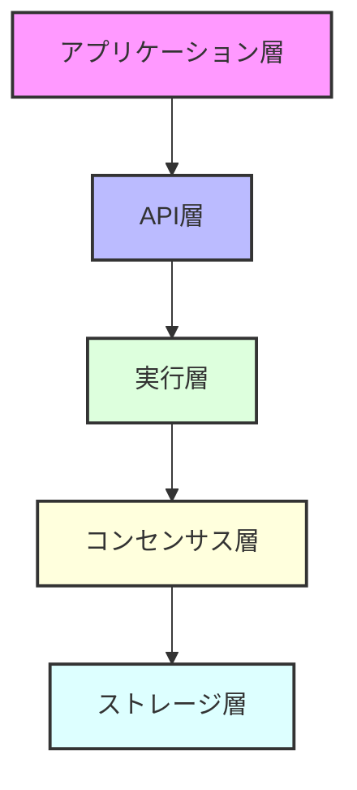

<div align="center">

# 🚀 Rustorium

**次世代の超低遅延・地理分散型ブロックチェーンプラットフォーム**

[](https://opensource.org/licenses/MIT)
[](https://www.rust-lang.org)
[](https://github.com/enablerdao/rustorium/actions)
[](https://docs.rustorium.dev)
[](https://discord.gg/rustorium)

[English](README.en.md) | [中文](README.zh.md) | 日本語


[📚 ドキュメント](docs/) | [🌍 デモ](https://demo.rustorium.dev) | [💬 Discord](https://discord.gg/rustorium)

</div>

## 🌟 主な特徴

### ⚡️ 超高性能アーキテクチャ
- **100K+ TPS**: 業界最高レベルのトランザクション処理
- **< 100ms レイテンシ**: リアルタイム処理対応
- **シャーディング**: 自動スケーリング

### 🔧 堅牢な技術スタック
- **[RocksDB](https://rocksdb.org)**: 高性能KVストア
- **[libp2p](https://libp2p.io)**: P2Pネットワーク
- **[Tendermint](https://tendermint.com)**: BFTコンセンサス
- **[Wasmer](https://wasmer.io)**: WebAssembly実行環境

### 🛠 開発者フレンドリー
- **Rustネイティブ**: 型安全で高性能
- **充実したSDK**: 多言語サポート
- **豊富なツール**: CLI, デバッガー, etc.

### 📊 包括的なモニタリング
- **Prometheus/Grafana**: メトリクス可視化
- **OpenTelemetry**: 分散トレーシング
- **ELKスタック**: ログ分析

## 🏗 アーキテクチャ概要



詳細な技術スタックは[アーキテクチャドキュメント](docs/architecture/README.md)をご覧ください。

## 🚀 クイックスタート

```bash
# インストール
curl -sSf https://raw.githubusercontent.com/enablerdao/rustorium/main/scripts/install.sh | bash

# 開発モードで起動
rustorium --dev

# 本番モードで起動
rustorium --config config.toml
```

## 📚 ドキュメント

- [アーキテクチャ](docs/architecture/README.md)
- [APIリファレンス](docs/api/README.md)
- [開発ガイド](docs/guides/development.md)
- [運用ガイド](docs/guides/operations.md)

## 🛠 開発者向け

### 必要要件

- Rust 1.75.0+
- CMake 3.20+
- OpenSSL 1.1+

### ビルド方法

```bash
# リポジトリのクローン
git clone https://github.com/enablerdao/rustorium.git
cd rustorium

# 依存関係のインストール
cargo build

# テストの実行
cargo test

# ドキュメントの生成
cargo doc --open
```

## 🤝 コントリビューション

プロジェクトへの貢献を歓迎します！

- [コントリビューションガイド](CONTRIBUTING.md)
- [コーディング規約](docs/coding-standards.md)
- [ロードマップ](docs/roadmap.md)

## 📄 ライセンス

このプロジェクトはMITライセンスで提供されています。詳細は[LICENSE](LICENSE)ファイルをご覧ください。

---

<div align="center">

**[🌟 スターをつける](https://github.com/enablerdao/rustorium)** | **[🐛 Issue報告](https://github.com/enablerdao/rustorium/issues)** | **[💬 Discord参加](https://discord.gg/rustorium)**

</div>
