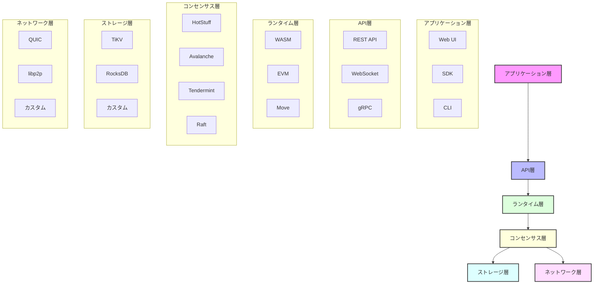

<div align="center">

# 🚀 Rustorium

**次世代のモジュラーブロックチェーンプラットフォーム**

[](https://opensource.org/licenses/MIT)
[](https://www.rust-lang.org)
[](https://github.com/enablerdao/rustorium/actions)
[](https://docs.rustorium.dev)
[](https://discord.gg/rustorium)

[English](README.en.md) | [中文](README.zh.md) | 日本語


[📚 ドキュメント](docs/) | [🌍 デモ](https://demo.rustorium.dev) | [💬 Discord](https://discord.gg/rustorium)

</div>

## 🌟 主な特徴

### ⚡️ モジュラーアーキテクチャ
- **プラグイン型設計**: 各レイヤーを自由に組み合わせ可能
- **柔軟なカスタマイズ**: 用途に応じて最適な構成を選択
- **高い拡張性**: 新しいモジュールを簡単に追加可能

### 🔧 モジュール一覧

#### 1. ネットワークレイヤー
- **[QUIC](docs/tech-stack/quic.md)**: 超低遅延P2Pネットワーク
- **[libp2p](docs/tech-stack/libp2p.md)**: 分散P2Pプロトコル
- **カスタム**: 独自のネットワークプロトコル

#### 2. コンセンサスレイヤー
- **[HotStuff](docs/tech-stack/hotstuff.md)**: BFTコンセンサス
- **[Avalanche](docs/tech-stack/avalanche.md)**: 確率的コンセンサス
- **[Tendermint](docs/tech-stack/tendermint.md)**: BFTコンセンサス
- **[Raft](docs/tech-stack/raft.md)**: 分散合意アルゴリズム

#### 3. ストレージレイヤー
- **[TiKV](docs/tech-stack/tikv.md)**: 分散KVストア
- **[RocksDB](docs/tech-stack/rocksdb.md)**: 高性能ローカルストレージ
- **カスタム**: 独自のストレージエンジン

#### 4. ランタイムレイヤー
- **[WebAssembly](docs/tech-stack/wasm.md)**: WAMSランタイム
- **[EVM](docs/tech-stack/evm.md)**: Ethereumランタイム
- **[Move](docs/tech-stack/move.md)**: Moveランタイム
- **カスタム**: 独自のランタイム環境

### 🛠 開発者フレンドリー
- **Rustネイティブ**: 型安全で高性能
- **充実したSDK**: 多言語サポート
- **豊富なツール**: CLI, デバッガー, etc.

### 📊 包括的なモニタリング
- **Prometheus/Grafana**: メトリクス可視化
- **OpenTelemetry**: 分散トレーシング
- **ELKスタック**: ログ分析

## 🏗 アーキテクチャ概要



## 🚀 クイックスタート

```bash
# インストール
curl -sSf https://raw.githubusercontent.com/enablerdao/rustorium/main/scripts/install.sh | bash

# 開発モードで起動（デフォルト構成）
rustorium --dev

# カスタム構成で起動
rustorium --config config.toml
```

### カスタム構成例

```toml
[network]
module = "quic"  # or "libp2p" or "custom"

[consensus]
module = "hotstuff"  # or "avalanche" or "tendermint" or "raft"

[storage]
module = "tikv"  # or "rocksdb" or "custom"

[runtime]
module = "wasm"  # or "evm" or "move" or "custom"

[api]
modules = ["rest", "websocket", "grpc"]
```

## 📚 ドキュメント

- [アーキテクチャ](docs/architecture/README.md)
- [モジュール設計](docs/modules/README.md)
- [APIリファレンス](docs/api/README.md)
- [開発ガイド](docs/guides/development.md)
- [運用ガイド](docs/guides/operations.md)

## 🛠 開発者向け

### 必要要件

- Rust 1.75.0+
- CMake 3.20+
- OpenSSL 1.1+

### ビルド方法

```bash
# リポジトリのクローン
git clone https://github.com/enablerdao/rustorium.git
cd rustorium

# 依存関係のインストール
cargo build

# 特定のモジュールのみビルド
cargo build -p rustorium-network --features quic
cargo build -p rustorium-consensus --features hotstuff
cargo build -p rustorium-storage --features tikv
cargo build -p rustorium-runtime --features wasm

# テストの実行
cargo test

# ドキュメントの生成
cargo doc --open
```

## 🤝 コントリビューション

プロジェクトへの貢献を歓迎します！

- [コントリビューションガイド](CONTRIBUTING.md)
- [コーディング規約](docs/coding-standards.md)
- [ロードマップ](docs/roadmap.md)

## 📄 ライセンス

このプロジェクトはMITライセンスで提供されています。詳細は[LICENSE](LICENSE)ファイルをご覧ください。

---

<div align="center">

**[🌟 スターをつける](https://github.com/enablerdao/rustorium)** | **[🐛 Issue報告](https://github.com/enablerdao/rustorium/issues)** | **[💬 Discord参加](https://discord.gg/rustorium)**

</div>
