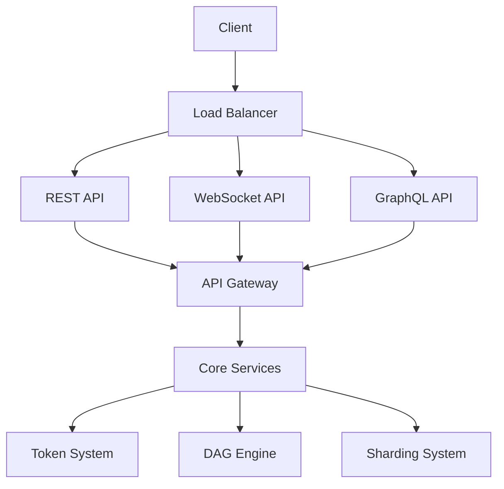

# API Overview

Rustorium provides three types of APIs for interacting with the platform:

1. [RESTful API](rest.md)
2. [WebSocket API](websocket.md)
3. [GraphQL API](graphql.md)

## API Architecture

## Common Features

- Authentication and Authorization
- Rate Limiting
- Error Handling
- Versioning
- Documentation
- CORS Support
- Monitoring and Metrics

## API Comparison

| Feature | REST | WebSocket | GraphQL |
|---------|------|-----------|---------|
| Real-time Updates | ❌ | ✅ | ✅* |
| Query Flexibility | ❌ | ❌ | ✅ |
| Caching | ✅ | ❌ | ✅ |
| Bandwidth Usage | High | Low | Medium |
| Implementation Complexity | Low | Medium | High |
| Client Support | Excellent | Good | Good |

*Via subscriptions

## Getting Started

1. [API Keys and Authentication](authentication.md)
2. [Rate Limits and Quotas](rate-limits.md)
3. [Error Handling](error-handling.md)
4. [Best Practices](best-practices.md)

## API Status

All APIs are monitored at [status.rustorium.com](https://status.rustorium.com)