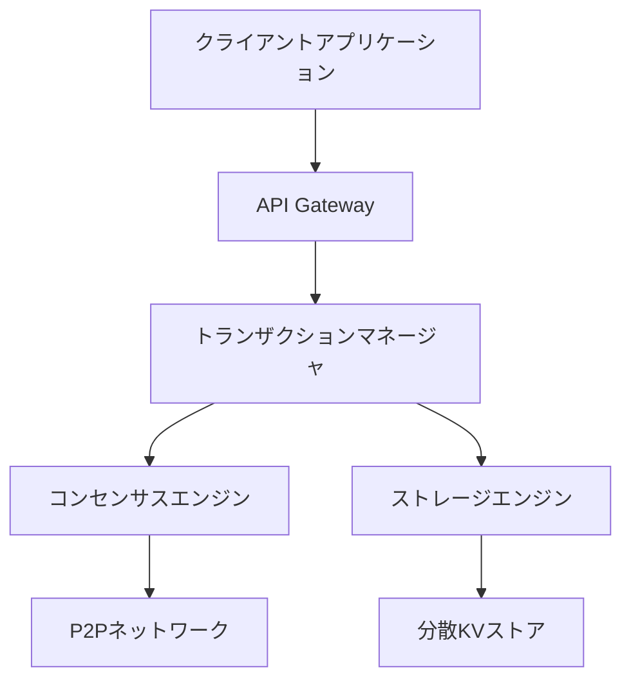

# Rustorium アーキテクチャ

## システム概要

Rustoriumは、以下の特徴を持つ次世代ブロックチェーンプラットフォームです：

- 超低遅延トランザクション処理
- グローバル分散処理
- 高度なスケーラビリティ
- 強力なセキュリティ

## コアコンポーネント



### 1. ネットワーク層 (QUIC)

```rust
pub struct NetworkManager {
    quic_endpoint: QuicEndpoint,
    peer_manager: PeerManager,
    message_handler: MessageHandler,
}

impl NetworkManager {
    // QUICエンドポイントの初期化
    pub async fn new() -> Self {
        // QUICの設定
        let config = QuicConfig {
            max_concurrent_streams: 1000,
            keep_alive_interval: Duration::from_secs(10),
            // その他の最適化設定
        };
        
        // エンドポイントの作成
        let endpoint = QuicEndpoint::new(config);
        
        Self {
            quic_endpoint: endpoint,
            peer_manager: PeerManager::new(),
            message_handler: MessageHandler::new(),
        }
    }

    // メッセージの送信
    pub async fn send_message(&self, peer: PeerId, message: Message) {
        // QUICストリームを開く
        let stream = self.quic_endpoint.open_stream(peer).await?;
        
        // メッセージを送信
        stream.send(message).await?;
    }
}
```

### 2. トランザクション処理 (Redpanda)

```rust
pub struct TransactionManager {
    producer: RedpandaProducer,
    consumer: RedpandaConsumer,
    mempool: TransactionPool,
}

impl TransactionManager {
    // トランザクションの処理
    pub async fn process_transaction(&mut self, tx: Transaction) -> Result<TxHash> {
        // バリデーション
        self.validate_transaction(&tx)?;
        
        // メモリプールに追加
        self.mempool.add_transaction(tx.clone())?;
        
        // Redpandaにパブリッシュ
        self.producer.publish("transactions", tx).await?;
        
        Ok(tx.hash())
    }

    // トランザクションの購読
    pub async fn subscribe_transactions(&mut self) {
        let mut stream = self.consumer.subscribe("transactions").await?;
        
        while let Some(tx) = stream.next().await {
            self.handle_transaction(tx).await?;
        }
    }
}
```

### 3. コンセンサス (Gluon)

```rust
pub struct ConsensusEngine {
    gluon: GluonNode,
    validator_set: ValidatorSet,
    state_machine: StateMachine,
}

impl ConsensusEngine {
    // コンセンサスの実行
    pub async fn run(&mut self) {
        // Gluonノードの初期化
        self.gluon.initialize().await?;
        
        // バリデータの設定
        self.validator_set.update().await?;
        
        // コンセンサスループ
        loop {
            // 新しいブロックの提案
            let block = self.propose_block().await?;
            
            // 合意形成
            let consensus = self.gluon.reach_consensus(block).await?;
            
            // ブロックの確定
            if consensus.is_committed() {
                self.finalize_block(block).await?;
            }
        }
    }
}
```

### 4. キャッシュ (Noria)

```rust
pub struct CacheManager {
    noria: NoriaInstance,
    views: HashMap<String, View>,
}

impl CacheManager {
    // キャッシュビューの作成
    pub async fn create_view(&mut self, name: &str, query: Query) -> Result<View> {
        // Noriaビューの定義
        let view = self.noria.create_view(name, query).await?;
        
        // ビューの最適化
        view.optimize().await?;
        
        self.views.insert(name.to_string(), view.clone());
        Ok(view)
    }

    // データの更新
    pub async fn update_data(&mut self, key: &str, value: &[u8]) -> Result<()> {
        // 関連するビューの更新
        for view in self.views.values_mut() {
            view.update(key, value).await?;
        }
        Ok(())
    }
}
```

### 5. ストレージ (TiKV + Redb)

```rust
pub struct StorageEngine {
    tikv: TiKVClient,
    redb: RedbInstance,
    poseidon: PoseidonHasher,
}

impl StorageEngine {
    // データの保存
    pub async fn store(&mut self, key: &[u8], value: &[u8]) -> Result<Hash> {
        // TiKVに保存
        self.tikv.put(key, value).await?;
        
        // Redbにもバックアップ
        self.redb.insert(key, value)?;
        
        // Poseidonハッシュの計算
        let hash = self.poseidon.hash(value);
        
        Ok(hash)
    }

    // データの取得
    pub async fn get(&self, key: &[u8]) -> Result<Option<Vec<u8>>> {
        // まずRedbから検索
        if let Some(value) = self.redb.get(key)? {
            return Ok(Some(value));
        }
        
        // TiKVから検索
        self.tikv.get(key).await
    }
}
```

## 実装の詳細

### トランザクションフロー

1. クライアントからのトランザクション受信
```rust
// QUICを使用した低遅延通信
async fn receive_transaction(stream: QuicStream) -> Result<Transaction> {
    let tx = stream.receive_transaction().await?;
    TransactionManager::process_transaction(tx).await
}
```

2. トランザクションの検証と処理
```rust
// Redpandaを使用した分散処理
async fn process_transaction(tx: Transaction) -> Result<()> {
    // バリデーション
    tx.validate()?;
    
    // Redpandaにパブリッシュ
    producer.publish("transactions", tx).await?;
    
    // 処理結果の待機
    wait_for_confirmation(tx.hash()).await
}
```

3. コンセンサスの実行
```rust
// Gluonを使用した高速合意形成
async fn reach_consensus(block: Block) -> Result<ConsensusResult> {
    // バリデータセットの取得
    let validators = validator_set.get_active_validators().await?;
    
    // Gluonコンセンサスの実行
    gluon.propose_block(block, validators).await
}
```

4. ステート更新
```rust
// Noriaを使用したキャッシュ最適化
async fn update_state(tx: Transaction) -> Result<()> {
    // ステートの更新
    let state_update = state_machine.apply_transaction(tx).await?;
    
    // キャッシュの更新
    cache_manager.update_views(state_update).await?;
    
    // ストレージへの永続化
    storage_engine.store_state(state_update).await
}
```

### パフォーマンス最適化

1. 並列処理
```rust
// トランザクションの並列実行
async fn execute_transactions(txs: Vec<Transaction>) -> Result<Vec<Receipt>> {
    stream::iter(txs)
        .map(|tx| execute_transaction(tx))
        .buffer_unordered(MAX_CONCURRENT_TXS)
        .collect()
        .await
}
```

2. キャッシュ最適化
```rust
// Noriaを使用したビューの最適化
async fn optimize_views() -> Result<()> {
    // アクセスパターンの分析
    let patterns = analyze_access_patterns().await?;
    
    // ビューの再構築
    cache_manager.rebuild_views(patterns).await
}
```

3. ネットワーク最適化
```rust
// QUICを使用した低遅延通信
async fn optimize_network() -> Result<()> {
    // 輻輳制御の設定
    quic_config.set_congestion_control(BBR);
    
    // ストリーム多重化の設定
    quic_config.set_max_streams(MAX_STREAMS);
}
```

### セキュリティ対策

1. トランザクション検証
```rust
// Poseidonを使用したハッシュ検証
fn verify_transaction(tx: &Transaction) -> Result<bool> {
    // 署名の検証
    tx.verify_signature()?;
    
    // Poseidonハッシュの検証
    poseidon.verify_hash(tx.hash(), tx.data())
}
```

2. コンセンサスセキュリティ
```rust
// Gluonのセキュリティ設定
async fn secure_consensus() -> Result<()> {
    // バリデータの認証
    gluon.set_validator_authentication(true);
    
    // BFTパラメータの設定
    gluon.set_fault_tolerance(FAULT_TOLERANCE_THRESHOLD);
}
```

## モニタリングと運用

1. メトリクス収集
```rust
// パフォーマンスメトリクスの収集
async fn collect_metrics() -> Result<()> {
    // トランザクションメトリクス
    metrics.record_tps(calculate_tps().await?);
    
    // レイテンシメトリクス
    metrics.record_latency(measure_latency().await?);
    
    // リソースメトリクス
    metrics.record_resource_usage(get_resource_stats().await?);
}
```

2. アラート設定
```rust
// 異常検知とアラート
async fn monitor_system() -> Result<()> {
    // パフォーマンスアラート
    if tps.below_threshold() {
        alert.send("TPS低下検知").await?;
    }
    
    // エラーアラート
    if error_rate.above_threshold() {
        alert.send("エラー率上昇").await?;
    }
}
```

## デプロイメントガイド

1. ノードのデプロイ
```bash
# 設定ファイルの準備
cp config/production.toml.example /etc/rustorium/config.toml

# 環境変数の設定
export RUSTORIUM_NETWORK=mainnet
export RUSTORIUM_VALIDATORS=validator1.example.com,validator2.example.com

# ノードの起動
rustorium --config /etc/rustorium/config.toml
```

2. モニタリングのセットアップ
```bash
# Prometheusの設定
cp monitoring/prometheus.yml /etc/prometheus/

# Grafanaのセットアップ
docker-compose -f monitoring/docker-compose.yml up -d
```

## 次のステップ

1. コア機能の実装
   - トランザクション処理エンジン
   - コンセンサスエンジン
   - ストレージエンジン

2. テストの作成
   - ユニットテスト
   - 統合テスト
   - パフォーマンステスト

3. ドキュメントの充実
   - APIリファレンス
   - 運用ガイド
   - トラブルシューティング

