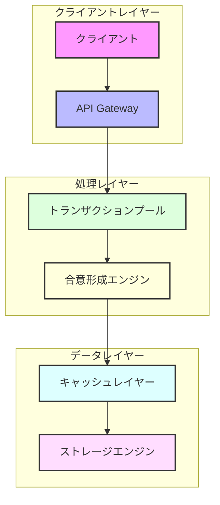
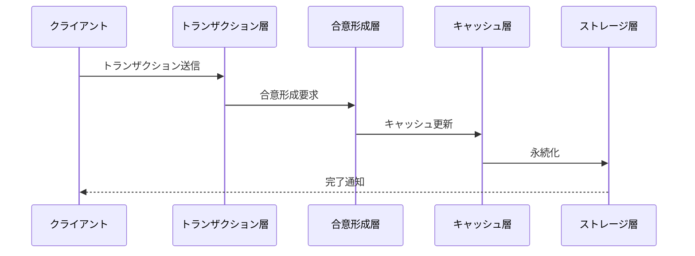
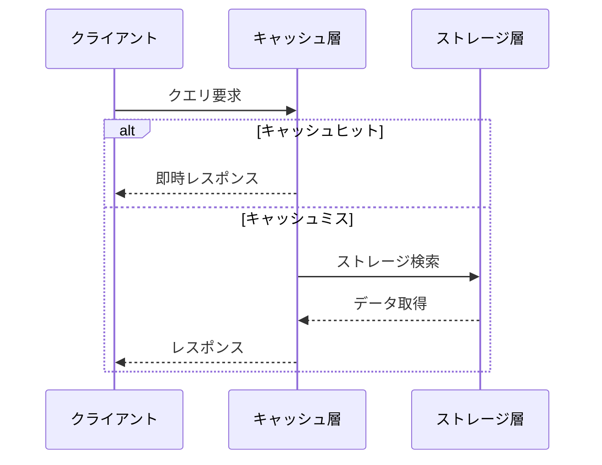

<div align="center">

# 🏗 アーキテクチャ設計

**Rustoriumの技術スタックと設計思想**


</div>

---

## 📖 目次

- [設計思想](#-設計思想)
- [システム構成](#-システム構成)
- [コアコンポーネント](#-コアコンポーネント)
- [データフロー](#-データフロー)
- [スケーラビリティ](#-スケーラビリティ)
- [セキュリティ](#-セキュリティ)
- [運用性](#-運用性)

---

## 🎯 設計思想

Rustoriumは以下の3つの設計原則に基づいて構築されています：

### 1. 超低遅延

- **QUICベースP2P**: 最新のトランスポートプロトコル
- **地理的最適化**: クライアントに最も近いノードで処理
- **パイプライン処理**: 並列性の最大活用

### 2. 高スケーラビリティ

- **動的シャーディング**: 負荷に応じた自動分散
- **地理分散処理**: グローバルな処理の最適化
- **水平スケーリング**: ノード数に応じた線形なスケール

### 3. 高信頼性

- **ZK証明**: 数学的な正当性の保証
- **AI自己最適化**: 継続的なパフォーマンス改善
- **自動障害検知/回復**: システムの堅牢性確保

---

## 🔄 システム構成



---

## 🛠 コアコンポーネント

### 1. トランザクション処理

```rust
/// トランザクション処理エンジン
pub trait TransactionProcessor {
    /// トランザクションの送信
    async fn submit_transaction(&self, tx: Transaction) -> Result<TxReceipt>;
    
    /// トランザクションの状態確認
    async fn get_transaction(&self, tx_hash: Hash) -> Result<Option<Transaction>>;
    
    /// トランザクションストリームの購読
    async fn subscribe_transactions(&self) -> Result<TransactionStream>;
}

/// トランザクションの構造
#[derive(Debug, Clone, Serialize, Deserialize)]
pub struct Transaction {
    /// トランザクションID
    pub id: TxId,
    
    /// 送信者の位置情報
    pub location: GeoLocation,
    
    /// トランザクションデータ
    pub data: Vec<u8>,
    
    /// 署名
    pub signature: Signature,
}
```

### 2. 合意形成

```rust
/// 合意形成エンジン
pub trait ConsensusEngine {
    /// ブロックの提案
    async fn propose_block(&self, block: Block) -> Result<BlockHash>;
    
    /// ブロックの検証
    async fn validate_block(&self, block: &Block) -> Result<bool>;
    
    /// クォーラムの待機
    async fn wait_for_quorum(&self, block_hash: BlockHash) -> Result<()>;
}

/// ブロックの構造
#[derive(Debug, Clone)]
pub struct Block {
    /// ブロックヘッダー
    pub header: BlockHeader,
    
    /// トランザクションリスト
    pub transactions: Vec<Transaction>,
    
    /// 証明
    pub proof: BlockProof,
}
```

### 3. ストレージ

```rust
/// ストレージエンジン
pub trait Storage {
    /// データの書き込み（証明付き）
    async fn write_with_proof(&self, key: &[u8], value: &[u8]) -> Result<WriteResult>;
    
    /// データの読み取り
    async fn read(&self, key: &[u8]) -> Result<Option<ReadResult>>;
    
    /// 証明の検証
    async fn verify_proof(&self, proof: &Proof) -> Result<bool>;
}

/// 書き込み結果
#[derive(Debug)]
pub struct WriteResult {
    /// マークルプルーフ
    pub proof: MerkleProof,
    
    /// タイムスタンプ
    pub timestamp: SystemTime,
}
```

---

## 📊 データフロー

### 1. トランザクション処理フロー



### 2. クエリ処理フロー



---

## 📈 スケーラビリティ

### 垂直スケーリング
- **CPU**: 最大128コア
- **メモリ**: 最大2TB
- **ストレージ**: 最大1PB

### 水平スケーリング
- **ノード**: 無制限
- **シャード**: 動的
- **リージョン**: グローバル

### 最適化
- **自動負荷分散**
- **予測的スケーリング**
- **リソース最適化**

---

## 🔒 セキュリティ

### 1. 暗号化
- **通信**: TLS 1.3 + QUIC
- **ストレージ**: AES-256-GCM
- **メモリ**: セキュアメモリ

### 2. 検証
- **トランザクション**: ZKプルーフ
- **ステート**: Verkle Trees
- **ネットワーク**: P2P認証

### 3. 監視
- **異常検知**: AIベース
- **監査ログ**: 改ざん検知付き
- **メトリクス**: Prometheus + Grafana

---

## 🔧 運用性

### 1. モニタリング
```bash
# メトリクス収集
rustorium metrics collect

# パフォーマンス分析
rustorium analyze performance

# ログ集約
rustorium logs aggregate
```

### 2. 管理機能
```bash
# ノード追加
rustorium node add --region asia-northeast

# シャード再配置
rustorium shard rebalance

# バックアップ作成
rustorium backup create
```

### 3. 障害対応
```bash
# 自動復旧
rustorium recover auto

# 手動復旧
rustorium recover manual

# 状態確認
rustorium status check
```

---

## 📚 関連ドキュメント

- [QUIC実装詳細](../features/quic.md)
- [ストレージ設計](storage.md)
- [シャーディング](../features/sharding.md)
- [パフォーマンスチューニング](../guides/performance.md)

