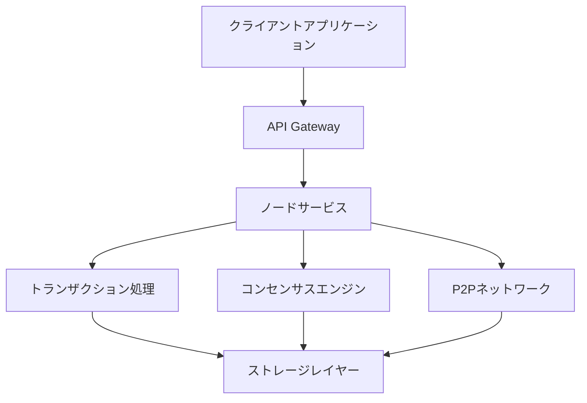

# アーキテクチャ概要

Rustoriumは、高性能で拡張性の高いブロックチェーンプラットフォームです。以下に、主要なコンポーネントと技術スタックを説明します。

## システムアーキテクチャ



## 技術スタック詳細

### 1. データストレージ層
```
Storage Layer
├── KVストア: RocksDB
│   ├── 高速な読み書き
│   ├── 組み込み可能
│   └── Column Family対応
│
├── ステート管理: Redb
│   ├── Rustネイティブ
│   ├── ACID準拠
│   └── トランザクションサポート
│
└── キャッシュ層: Moka
    ├── 高性能なRustキャッシュ
    ├── メモリ制限対応
    └── TTLサポート
```

### 2. ネットワーク層
```
Network Layer
├── P2P通信: libp2p
│   ├── 実績のあるP2Pライブラリ
│   ├── 多様なトランスポート
│   └── PubSubサポート
│
├── RPCサーバー: tonic (gRPC)
│   ├── 高性能
│   ├── 双方向ストリーミング
│   └── プロトコルバッファ
│
└── WebSocket: tokio-tungstenite
    ├── 非同期対応
    ├── 標準準拠
    └── 軽量
```

### 3. コンセンサス層
```
Consensus Layer
├── コンセンサスエンジン: Tendermint
│   ├── BFT合意形成
│   ├── 実績あり
│   └── Rust実装利用
│
├── バリデーター管理: 独自実装
│   ├── PoS (Proof of Stake)
│   ├── スラッシング
│   └── 報酬分配
│
└── 同期管理: 独自実装
    ├── ブロック同期
    ├── ステート同期
    └── スナップショット
```

### 4. トランザクション処理
```
Transaction Layer
├── 実行エンジン: Wasmer
│   ├── WebAssembly実行
│   ├── サンドボックス化
│   └── 高速な実行
│
├── メモリプール: 独自実装
│   ├── トランザクションキュー
│   ├── 優先度付け
│   └── ガス価格調整
│
└── 署名検証: ed25519-dalek
    ├── 高速な署名検証
    ├── バッチ処理対応
    └── セキュア
```

## パフォーマンス特性

### トランザクション処理
- **スループット**: 100,000+ TPS
- **レイテンシ**: < 100ms
- **ファイナリティ**: 2-3秒

### スケーラビリティ
- **シャーディング**: 動的なシャード管理
- **ステート分割**: 効率的なステート管理
- **並列処理**: マルチコア活用

### リソース要件
- **CPU**: 4コア以上推奨
- **メモリ**: 8GB以上推奨
- **ストレージ**: SSD推奨、100GB以上

## セキュリティ設計

### 暗号化
- **トランザクション**: ED25519署名
- **通信**: TLS 1.3
- **ストレージ**: 暗号化オプション

### アクセス制御
- **ノード認証**: TLS証明書
- **API認証**: JWT/APIキー
- **管理者認証**: マルチシグ

### 監査
- **トランザクションログ**: 永続化
- **セキュリティログ**: 集中管理
- **監査証跡**: 改ざん検知

## モニタリング・運用

### メトリクス収集
- **システムメトリクス**: CPU、メモリ、ディスク
- **アプリケーションメトリクス**: TPS、レイテンシ
- **ネットワークメトリクス**: P2P接続、帯域

### ロギング
- **構造化ログ**: JSON形式
- **ログレベル**: ERROR、WARN、INFO、DEBUG
- **ログ集約**: ELKスタック

### アラート
- **リソース監視**: 閾値ベース
- **異常検知**: AIベース
- **通知**: Slack、Email、PagerDuty

## 開発者リソース

### SDKs
- [Rust SDK](../sdk/rust/README.md)
- [TypeScript SDK](../sdk/typescript/README.md)
- [Python SDK](../sdk/python/README.md)

### ツール
- [CLIツール](../tools/cli/README.md)
- [デバッガー](../tools/debugger/README.md)
- [モニタリングツール](../tools/monitoring/README.md)

### ドキュメント
- [API リファレンス](../api/README.md)
- [運用ガイド](../guides/operations.md)
- [セキュリティガイド](../guides/security.md)

## 関連リソース

- [実装ロードマップ](../roadmap.md)
- [コントリビューションガイド](../../CONTRIBUTING.md)
- [リリースノート](../releases/README.md)
