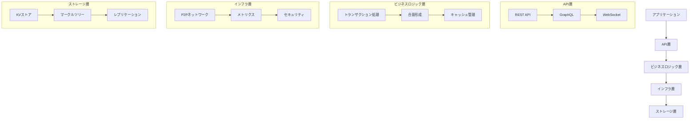
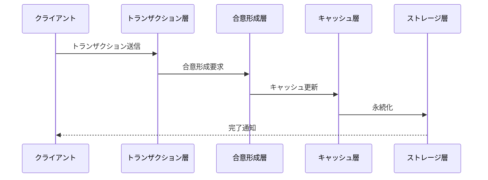
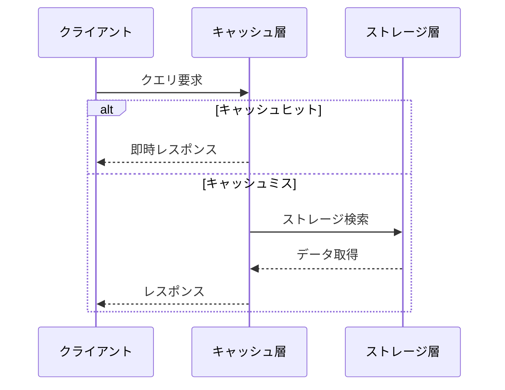

# 👨‍💻 開発者向けアーキテクチャガイド

## 🔍 技術スタック概要

### 1️⃣ 基盤技術
| 技術 | 用途 | ドキュメント |
|------|------|--------------|
| [QUIC] | 超低遅延P2P通信 | [QUIC詳細](../features/quic.md) |
| [Redpanda] | トランザクション処理 | [Redpanda詳細](../features/redpanda.md) |
| [Redb] | 高性能KVストア | [Redb詳細](../features/redb.md) |
| [Noria] | リアルタイムキャッシュ | [Noria詳細](../features/noria.md) |
| [Poseidon] | ZKフレンドリーハッシュ | [Poseidon詳細](../features/poseidon.md) |

### 2️⃣ 主要コンポーネント


## 💻 コードベース構造

### 1️⃣ ディレクトリ構造
```
rustorium/
├── src/
│   ├── core/           # コアロジック
│   │   ├── transaction/  # トランザクション処理
│   │   ├── consensus/    # 合意形成
│   │   ├── cache/       # キャッシュ管理
│   │   ├── storage/     # ストレージ
│   │   └── network/     # P2P通信
│   ├── api/            # API実装
│   ├── services/       # サービス層
│   ├── utils/          # ユーティリティ
│   └── main.rs         # エントリーポイント
├── tests/             # テストスイート
├── benches/           # ベンチマーク
└── docs/             # ドキュメント
```

### 2️⃣ 主要トレイト
```rust
/// トランザクション処理
pub trait TransactionProcessor {
    async fn submit_transaction(&self, tx: Transaction) -> Result<TxReceipt>;
    async fn get_transaction(&self, tx_hash: Hash) -> Result<Option<Transaction>>;
}

/// 合意形成
pub trait ConsensusEngine {
    async fn propose_block(&self, block: Block) -> Result<BlockHash>;
    async fn validate_block(&self, block: &Block) -> Result<bool>;
}

/// キャッシュ管理
pub trait CacheManager {
    async fn get(&self, key: &[u8]) -> Result<Option<Vec<u8>>>;
    async fn set(&self, key: &[u8], value: &[u8]) -> Result<()>;
    async fn optimize(&self) -> Result<()>;
}

/// ストレージ
pub trait Storage {
    async fn write_with_proof(&self, key: &[u8], value: &[u8]) -> Result<WriteResult>;
    async fn read(&self, key: &[u8]) -> Result<Option<ReadResult>>;
    async fn verify_proof(&self, proof: &Proof) -> Result<bool>;
}
```

## 🔄 データフロー

### 1️⃣ トランザクション処理フロー


### 2️⃣ クエリ処理フロー


## 🔧 実装詳細

### 1️⃣ QUIC通信
```rust
pub struct QuicNetwork {
    endpoint: Endpoint,
    connections: Arc<Mutex<HashMap<PeerId, Connection>>>,
    config: NetworkConfig,
}

impl QuicNetwork {
    pub async fn send_message(&self, peer_id: &PeerId, message: Message) -> Result<()> {
        let conn = self.get_connection(peer_id).await?;
        let (mut send, mut recv) = conn.open_bi().await?;
        
        send.write_all(&message.serialize()?).await?;
        send.finish().await?;
        
        let response = recv.read_to_end().await?;
        Ok(())
    }
}
```

### 2️⃣ Redpanda統合
```rust
pub struct TransactionManager {
    producer: RedpandaProducer,
    consumer: RedpandaConsumer,
    config: TransactionConfig,
}

impl TransactionManager {
    pub async fn submit_transaction(&self, tx: Transaction) -> Result<TxReceipt> {
        let shard = self.determine_shard(&tx);
        let topic = format!("transactions-{}", shard);
        
        self.producer.send(topic, tx.serialize()?).await?;
        Ok(TxReceipt::new(tx.id()))
    }
}
```

### 3️⃣ Redbストレージ
```rust
pub struct RedbStorage {
    db: Database,
    merkle_tree: Arc<Mutex<PoseidonMerkleTree>>,
}

impl Storage for RedbStorage {
    async fn write_with_proof(&self, key: &[u8], value: &[u8]) -> Result<WriteResult> {
        let mut tree = self.merkle_tree.lock().await;
        let proof = tree.insert(key, value)?;
        
        let txn = self.db.begin_write()?;
        txn.insert(key, value)?;
        txn.commit()?;
        
        Ok(WriteResult { proof })
    }
}
```

## 🔍 デバッグとプロファイリング

### 1️⃣ メトリクス収集
```rust
pub struct Metrics {
    transaction_counter: Counter,
    latency_histogram: Histogram,
    memory_gauge: Gauge,
}

impl Metrics {
    pub fn record_transaction(&self, duration: Duration) {
        self.transaction_counter.inc();
        self.latency_histogram.observe(duration.as_secs_f64());
    }
}
```

### 2️⃣ トレーシング
```rust
#[tracing::instrument(skip(self))]
pub async fn process_transaction(&self, tx: Transaction) -> Result<()> {
    let start = Instant::now();
    
    tracing::info!("Processing transaction: {}", tx.id());
    let result = self.inner_process_transaction(tx).await;
    
    let duration = start.elapsed();
    tracing::info!("Transaction processed in {:?}", duration);
    
    result
}
```

## 📚 関連ドキュメント

- [QUIC実装詳細](../features/quic.md)
- [Redpanda統合](../features/redpanda.md)
- [Redbストレージ](../features/redb.md)
- [キャッシュ最適化](../features/cache.md)
- [ZK証明](../features/zk-proofs.md)

[QUIC]: https://docs.rs/quinn/latest/quinn/
[Redpanda]: https://redpanda.com/docs
[Redb]: https://docs.rs/redb/latest/redb/
[Noria]: https://github.com/mit-pdos/noria
[Poseidon]: https://www.poseidon-hash.info/
