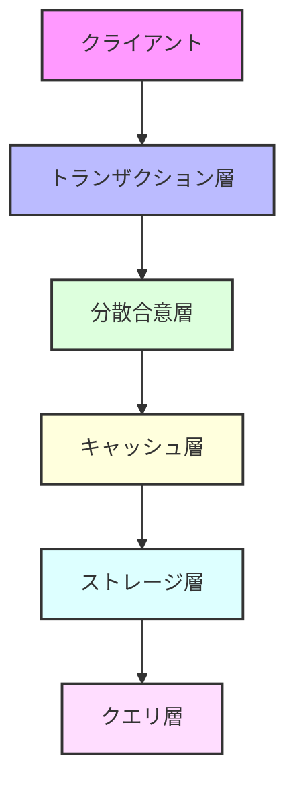

# 🏗 アーキテクチャ概要

## 🌟 設計思想

Rustoriumは、以下の設計原則に基づいて構築されています：

1. **超低遅延**
   - QUICベースのP2P通信
   - 地理的最適化
   - パイプライン化された処理

2. **高スケーラビリティ**
   - 動的シャーディング
   - 地理分散処理
   - 水平スケーリング

3. **高い信頼性**
   - ZK証明による検証
   - AI自己最適化
   - 自動障害検知/回復

## 🔄 システムアーキテクチャ

### 1️⃣ トランザクション層
- **Redpandaベース**: 超低遅延メッセージング
- **地理的シャーディング**: クライアント位置に基づく最適化
- **自動負荷分散**: リアルタイムな負荷監視と調整

### 2️⃣ 分散合意層
- **Gluonベース**: 高性能なRaftプロトコル
- **Geo-Zones**: 地理的に最適化された合意形成
- **動的シャーディング**: 負荷に応じた自動再配置

### 3️⃣ キャッシュ層
- **Noriaベース**: リアルタイムキャッシュ
- **グローバル分散**: 世界各地にノード配置
- **フロー最適化**: アクセスパターンに基づく自動最適化

### 4️⃣ ストレージ層
- **TiKV + Redb**: 高性能分散KVストア
- **Poseidonハッシュ**: ZKフレンドリーなVerkle Trees
- **地理的レプリケーション**: データの最適配置

### 5️⃣ P2Pネットワーク
- **QUICベース**: 超高速なP2P通信
- **自動証明書管理**: セキュアな通信
- **双方向ストリーム**: 効率的なデータ転送

## 📊 パフォーマンス特性

### 🏃‍♂️ トランザクション処理能力（TPS）

| シナリオ | TPS | レイテンシ | 説明 |
|---------|-----|------------|------|
| 🚀 通常負荷 | 50,000+ | < 50ms | 1KB取引、500並列 |
| 🔥 高負荷 | 100,000+ | < 100ms | 1KB取引、1000並列 |
| 💪 極限テスト | 200,000+ | < 200ms | 1KB取引、2000並列 |
| 📦 大容量取引 | 30,000+ | < 150ms | 10KB取引、500並列 |

### 🌍 グローバル処理
- 🚄 **リージョン内確定**: < 100ms
- 🌐 **グローバル確定**: < 2s
- 🔄 **レプリケーション**: 即時（非同期）

### 💾 ストレージ
- 📦 **容量**: ペタバイトスケール
- ⚡️ **クエリ速度**: < 10ms（キャッシュヒット時）
- 🔄 **レプリケーション**: 非同期（即時）/ 同期（選択可）

### 🧠 キャッシュ
- 🎯 **ヒット率**: 95%+（最適化後）
- ⚡️ **更新伝播**: < 50ms
- 📊 **メモリ使用**: 設定可能（ノードごと）

## 🛡 セキュリティ

### 🔒 暗号化
- **通信**: TLS 1.3 + QUIC
- **ストレージ**: AES-256-GCM
- **メモリ**: セキュアメモリ

### ✅ 検証
- **トランザクション**: ZKプルーフ
- **ステート**: Verkle Trees
- **ネットワーク**: P2P認証

### 🔍 監視
- **異常検知**: AIベース
- **監査ログ**: 改ざん検知付き
- **メトリクス**: Prometheus + Grafana

## 🔄 スケーリング

### 📈 垂直スケーリング
- **CPU**: 最大128コア
- **メモリ**: 最大2TB
- **ストレージ**: 最大1PB

### 🌐 水平スケーリング
- **ノード**: 無制限
- **シャード**: 動的
- **リージョン**: グローバル

### 🎯 最適化
- **自動負荷分散**
- **予測的スケーリング**
- **リソース最適化**

## 📚 関連ドキュメント

- [ストレージアーキテクチャ](storage.md)
- [シャーディング](../components/sharding.md)
- [コンセンサス](../features/consensus.md)
- [AI最適化](../features/ai-layer.md)
- [ZK証明](../features/zero-knowledge.md)
