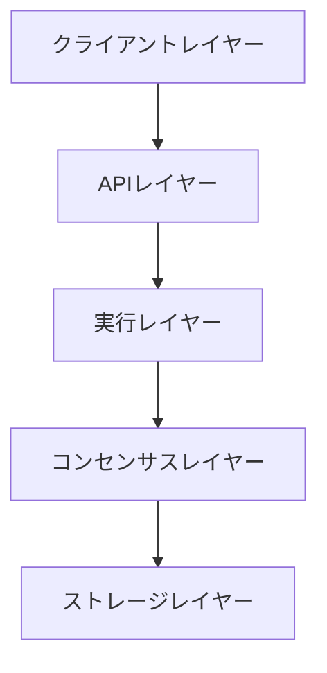

# 🏗️ アーキテクチャ概要

## 💫 設計思想

Rustoriumは、以下の3つの原則に基づいて設計されています：

### 1. 無限のスケーラビリティ
- **動的シャーディング**: 負荷に応じて自動的にネットワークを分割・統合
- **水平スケーリング**: ノード数に比例して処理能力が向上
- **スマートな負荷分散**: AIによる最適なリソース配分

### 2. 即時性と確実性
- **ハイブリッドコンセンサス**: 取引の性質に応じて最適な合意形成を選択
- **2段階確定**: 0.5秒で事前確定、1.0秒で完全確定
- **クロスシャード通信**: 超軽量なシャード間同期

### 3. 開発者エクスペリエンス
- **マルチ言語対応**: Rust, TypeScript, Python SDKを提供
- **プラグアブル**: 柔軟な機能拡張が可能
- **自己修復**: 自動エラー検知と回復

## 🔄 システム構成



### 1️⃣ クライアントレイヤー
- SDKs & CLI Tools
- ウォレットインテグレーション
- dAppsサポート

### 2️⃣ APIレイヤー
- REST / GraphQL / WebSocket
- JSON-RPC互換
- カスタムプロトコル

### 3️⃣ 実行レイヤー
- DAGベースの並列処理
- スマートコントラクト実行
- クロスシャードオーケストレーション

### 4️⃣ コンセンサスレイヤー
- ハイブリッドPoS
- シャードコンセンサス
- バリデーター管理

### 5️⃣ ストレージレイヤー
- 分散ステート管理
- 高速キャッシング
- データ永続化

## 🔐 セキュリティモデル

### 多層防御
1. **ネットワークレベル**
   - DDoS保護
   - P2P暗号化
   - ノード認証

2. **プロトコルレベル**
   - BFTコンセンサス
   - 経済的インセンティブ
   - スラッシング条件

3. **アプリケーションレベル**
   - スマートコントラクト監査
   - 実行環境分離
   - リソース制限

## 🎯 パフォーマンス特性

### 処理性能
| メトリクス | 値 |
|------------|-----|
| TPS | 100,000+ |
| レイテンシ | 0.5-1.0秒 |
| ファイナリティ | 1.0秒 |

### スケーリング特性
- **線形スケーリング**: ノード数に比例
- **自動最適化**: 負荷に応じた調整
- **リソース効率**: 最小限のオーバーヘッド

## 🔄 データフロー

### トランザクション処理
1. **受付**
   ```rust
   // トランザクションの受け付け
   tx.validate()
     .assign_shard()
     .propagate()
   ```

2. **実行**
   ```rust
   // 並列実行とステート管理
   shard.execute(tx)
       .update_state()
       .emit_events()
   ```

3. **確定**
   ```rust
   // コンセンサスと確定
   consensus.validate()
           .finalize()
           .notify()
   ```

## 🛠️ 開発者インターフェース

### SDKサポート
```typescript
// TypeScript SDK例
const client = new RustoriumClient({
    network: "mainnet",
    shard: "auto"
});

// トランザクション実行
const tx = await client.transaction
    .create()
    .send();
```

### スマートコントラクト
```solidity
// Solidityサポート
contract Example {
    function execute() public {
        // クロスシャード呼び出し
        CrossShard.call(
            shard_id,
            contract_addr,
            "method",
            args
        );
    }
}
```

## 📈 モニタリング・運用

### メトリクス収集
- **システムメトリクス**: CPU, メモリ, ディスク
- **ネットワークメトリクス**: レイテンシ, スループット
- **アプリケーションメトリクス**: TPS, 成功率

### 異常検知
- **AIベース監視**: パターン認識
- **自動アラート**: しきい値監視
- **予測分析**: 問題の事前検知

## 🔄 アップグレードプロセス

### プロトコルアップグレード
1. **提案**: ガバナンスによる承認
2. **テスト**: テストネットでの検証
3. **展開**: 段階的なロールアウト

### ノードアップグレード
```bash
# ノードソフトウェアの更新
rustorium node upgrade

# 設定の更新
rustorium config update
```

## 📚 関連ドキュメント

- [シャーディングシステム](../sharding.md)
- [コンセンサスメカニズム](../consensus.md)
- [スマートコントラクト](../smart-contracts.md)

---

<div align="center">

**[🔧 開発を始める](../guides/installation.md)** | **[📊 メトリクスを見る](https://metrics.rustorium.org)**

</div>