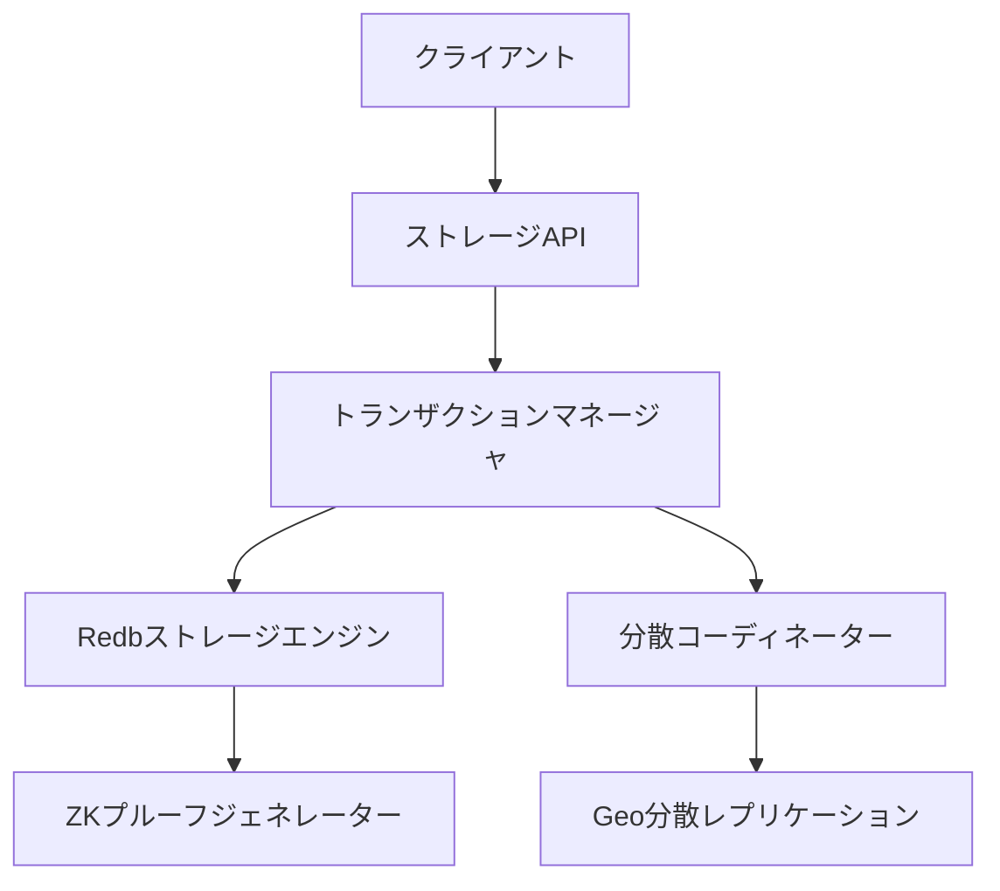

# 分散ストレージシステム

## 概要

Rustoriumの分散ストレージシステムは、TiKV/CockroachDBの設計思想を基に、Redbを用いて最適化された高性能なストレージエンジンです。ZK証明との親和性が高く、グローバルなGeo分散をサポートします。

## アーキテクチャ

### コアコンポーネント



### 主要な構造体

```rust
/// コアストレージエンジン
pub struct CoreStorage {
    /// Redbインスタンス
    db: Redb,
    /// Poseidonハッシュベースのマークルツリー
    merkle: PoseidonMerkleTree,
    /// ZK証明生成器
    zk_prover: ZkProver,
    /// Geo分散マネージャー
    geo_manager: GeoManager,
}

/// Geo分散管理
pub struct GeoManager {
    /// リージョン情報
    regions: HashMap<RegionId, RegionInfo>,
    /// レイテンシマップ
    latency_map: LatencyMap,
    /// 最適化エンジン
    optimizer: GeoOptimizer,
}

/// トランザクション管理
pub struct TransactionManager {
    /// アクティブなトランザクション
    active_txs: HashMap<TxId, Transaction>,
    /// 2PCコーディネーター
    coordinator: TwoPhaseCommitCoordinator,
}
```

## 実装詳細

### 1. 基本操作

#### データの書き込み
```rust
impl CoreStorage {
    pub async fn write(&mut self, key: &[u8], value: &[u8]) -> Result<WriteResult> {
        // トランザクション開始
        let tx = self.db.begin_write()?;
        
        // データ書き込み
        tx.insert(key, value)?;
        
        // マークルツリー更新
        let merkle_proof = self.merkle.insert(key, value)?;
        
        // ZK証明生成
        let zk_proof = self.zk_prover.generate_proof(key, value, &merkle_proof)?;
        
        // Geo分散レプリケーション
        self.geo_manager.replicate(key, value).await?;
        
        // コミット
        tx.commit()?;
        
        Ok(WriteResult {
            proof: zk_proof,
            timestamp: SystemTime::now(),
        })
    }
}
```

#### データの読み取り
```rust
impl CoreStorage {
    pub async fn read(&self, key: &[u8]) -> Result<ReadResult> {
        // 最近接リージョンからの読み取り
        let region = self.geo_manager.get_nearest_region()?;
        
        // データ読み取り
        let value = region.read(key).await?;
        
        // 証明の検証
        let proof = self.zk_prover.verify_read(key, &value)?;
        
        Ok(ReadResult {
            value,
            proof,
            region: region.id(),
        })
    }
}
```

### 2. Geo分散管理

#### リージョン最適化
```rust
impl GeoManager {
    pub async fn optimize_placement(&mut self) -> Result<()> {
        // レイテンシ分析
        let latencies = self.latency_map.analyze()?;
        
        // データ配置の最適化計算
        let optimal_placement = self.optimizer
            .calculate_optimal_placement(&latencies)?;
        
        // データ再配置の実行
        for placement in optimal_placement {
            self.move_data(
                placement.data_id,
                placement.source,
                placement.target
            ).await?;
        }
        
        Ok(())
    }
}
```

#### レプリケーション
```rust
impl GeoManager {
    pub async fn replicate(&self, key: &[u8], value: &[u8]) -> Result<()> {
        // レプリケーション先の選択
        let targets = self.select_replica_targets(key)?;
        
        // 並列レプリケーション
        let futures: Vec<_> = targets
            .iter()
            .map(|target| target.replicate(key, value))
            .collect();
        
        // 全レプリケーションの完了を待機
        futures::future::join_all(futures).await?;
        
        Ok(())
    }
}
```

### 3. パフォーマンス最適化

#### キャッシュ管理
```rust
impl CoreStorage {
    fn manage_cache(&mut self) -> Result<()> {
        // キャッシュ使用率の分析
        let stats = self.cache_analyzer.analyze()?;
        
        // ホットデータの特定
        let hot_data = stats.identify_hot_data()?;
        
        // キャッシュ戦略の最適化
        self.cache_optimizer.optimize(hot_data)?;
        
        Ok(())
    }
}
```

#### コンパクション
```rust
impl CoreStorage {
    async fn run_compaction(&mut self) -> Result<()> {
        // コンパクション必要性の評価
        if !self.should_compact()? {
            return Ok(());
        }
        
        // バックグラウンドでコンパクション実行
        tokio::spawn(async move {
            self.db.compact().await?;
            self.post_compaction_cleanup().await
        });
        
        Ok(())
    }
}
```

## パフォーマンス特性

### 1. レイテンシ
- ローカル読み取り: < 1ms
- ローカル書き込み: < 5ms
- クロスリージョン: < 100ms

### 2. スループット
- 単一リージョン: 50,000+ ops/s
- マルチリージョン: 10,000+ ops/s
- バッチ処理: 100,000+ ops/s

### 3. スケーラビリティ
- ノード数に対して線形
- リージョン数に対して対数的
- データサイズに対して対数的

## 運用考慮事項

### 1. モニタリング
- リージョン間レイテンシ
- レプリケーション遅延
- ストレージ使用率
- キャッシュヒット率

### 2. バックアップ
- 継続的なスナップショット
- クロスリージョンバックアップ
- 増分バックアップ

### 3. 障害復旧
- 自動フェイルオーバー
- データ再調整
- リージョン間同期

## セキュリティ

### 1. 暗号化
- 保存時の暗号化
- 転送時の暗号化
- キー管理

### 2. アクセス制御
- ロールベースアクセス
- 監査ログ
- トークンベース認証

### 3. コンプライアンス
- データ主権対応
- GDPR対応
- 監査証跡