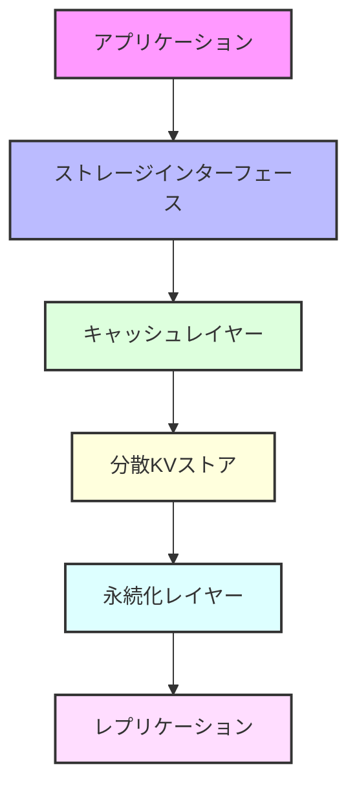

# 💾 ストレージアーキテクチャ

## 🌟 概要

Rustoriumのストレージレイヤーは、高性能、高信頼性、そしてZKプルーフフレンドリーな設計を特徴としています。

## 🏗 アーキテクチャ



### 1️⃣ ストレージインターフェース
```rust
pub trait Storage {
    async fn write_with_proof(&self, key: &[u8], value: &[u8]) -> Result<WriteResult>;
    async fn read(&self, key: &[u8]) -> Result<Option<ReadResult>>;
    async fn delete(&self, key: &[u8]) -> Result<()>;
    async fn verify_proof(&self, key: &[u8], value: &[u8], proof: &MerkleProof) -> Result<bool>;
}
```

### 2️⃣ キャッシュレイヤー（Noria）
- **リアルタイムキャッシュ**
- **フロー最適化**
- **地理的分散**

### 3️⃣ 分散KVストア（TiKV + Redb）
- **高性能KVストア**
- **ACID保証**
- **シャーディング**

### 4️⃣ 永続化（RocksDB）
- **LSMツリー**
- **圧縮**
- **スナップショット**

### 5️⃣ レプリケーション
- **非同期レプリケーション**
- **地理的分散**
- **自動修復**

## 🔐 データ構造

### Verkle Tree
```rust
pub struct VerkleTree {
    root: [u8; 32],
    nodes: HashMap<Vec<u8>, Node>,
}

pub struct Node {
    hash: [u8; 32],
    left: Option<Box<Node>>,
    right: Option<Box<Node>>,
}
```

### マークルプルーフ
```rust
pub struct MerkleProof {
    root: [u8; 32],
    path: Vec<[u8; 32]>,
    indices: Vec<bool>,
}
```

## 📊 パフォーマンス

### 書き込み性能
| 操作 | レイテンシ | スループット |
|------|------------|--------------|
| 単一書き込み | < 1ms | 100K/秒 |
| バッチ書き込み | < 10ms | 1M/秒 |
| プルーフ付き書き込み | < 5ms | 50K/秒 |

### 読み取り性能
| シナリオ | レイテンシ |
|----------|------------|
| キャッシュヒット | < 1ms |
| キャッシュミス | < 10ms |
| プルーフ検証 | < 5ms |

### ストレージ効率
| メトリック | 値 |
|------------|-----|
| 圧縮率 | 3-5x |
| インデックスオーバーヘッド | 10-15% |
| プルーフサイズ | 1-2KB |

## 🔄 最適化

### キャッシュ最適化
```rust
pub struct CacheConfig {
    pub max_size: usize,
    pub eviction_policy: EvictionPolicy,
    pub prefetch_enabled: bool,
}

pub enum EvictionPolicy {
    LRU,
    ARC,
    CLOCK,
    AI,
}
```

### 圧縮最適化
- **アダプティブ圧縮**
- **データ型別圧縮**
- **ホットデータ非圧縮**

### プルーフ最適化
- **バッチ検証**
- **インクリメンタル更新**
- **キャッシュ再利用**

## 🛡 セキュリティ

### 暗号化
- **保存時暗号化**
- **転送時暗号化**
- **キー管理**

### 監査
- **アクセスログ**
- **変更履歴**
- **整合性チェック**

### バックアップ
- **増分バックアップ**
- **地理的レプリケーション**
- **即時リカバリ**

## 📚 関連ドキュメント

- [アーキテクチャ概要](overview.md)
- [シャーディング](../components/sharding.md)
- [キャッシュ最適化](../features/cache-optimization.md)
- [ZK証明](../features/zero-knowledge.md)
