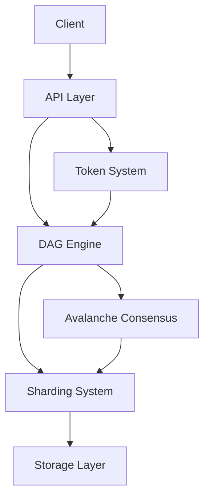

# Rustorium Components Overview

Rustorium is built on three core technologies that work together to provide a scalable, efficient, and user-friendly blockchain platform:

1. [DAG-based Transaction Processing](dag.md)
2. [Avalanche Consensus](avalanche.md)
3. [Dynamic Sharding](sharding.md)

## Core Components

### 1. [DAG Engine](dag.md)
The Directed Acyclic Graph (DAG) engine enables parallel transaction processing by tracking dependencies between transactions. This allows for:
- High throughput
- Natural conflict resolution
- Low latency
- Efficient scaling

### 2. [Avalanche Consensus](avalanche.md)
The Avalanche consensus mechanism provides:
- Sub-second finality
- High security
- Energy efficiency
- Metastability-free consensus
- Robust against Byzantine failures

### 3. [Dynamic Sharding](sharding.md)
The sharding system automatically scales by:
- Creating and managing shards based on network load
- Balancing transactions across shards
- Handling cross-shard transactions
- Synchronizing state between shards

### 4. [Token System](token.md)
The token system provides:
- Standard token functionality (ERC20-like)
- Smart contract support
- Token economics model
- AI-assisted token creation
- Modular design

## Component Interactions

## Implementation Status

| Component | Status | Description |
|-----------|--------|-------------|
| DAG Engine | ✅ | Core implementation complete |
| Avalanche Consensus | ✅ | Basic implementation complete |
| Sharding System | ✅ | Core functionality implemented |
| Token System | ✅ | Basic functionality complete |
| API Layer | 🚧 | In progress |
| Frontend | 🚧 | In progress |

## Next Steps

1. Complete API Layer
   - RESTful API
   - WebSocket support
   - GraphQL interface

2. Develop Frontend
   - Wallet interface
   - Token management
   - Trading interface

## Further Reading

- [Project Structure](../project-structure.md)
- [API Reference](../api-reference.md)
- [Contributing Guide](../../CONTRIBUTING.md)
- [Architecture Overview](../architecture.md)