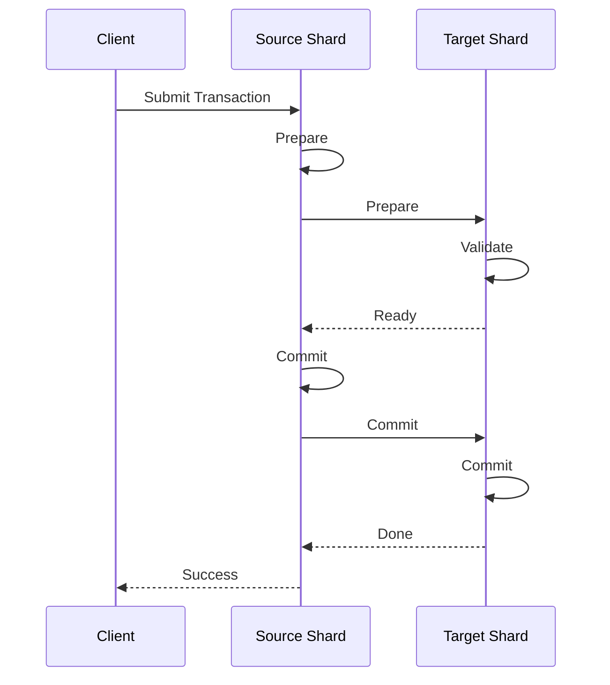

# Dynamic Sharding System

## Overview

The dynamic sharding system automatically scales the network by creating and managing shards based on network load. It provides efficient cross-shard transaction processing and state synchronization.

## Key Features

### 1. Dynamic Scaling
- Automatic shard creation and management
- Load-based scaling
- Efficient resource utilization

### 2. Cross-Shard Transactions
- Atomic cross-shard operations
- Two-phase commit protocol
- Dependency tracking

### 3. State Management
- Consistent state synchronization
- Efficient state merging
- Conflict resolution

## Implementation

### Core Components

```rust
pub struct ShardManager {
    /// Shard states
    shards: Arc<RwLock<HashMap<ShardId, ShardState>>>,
    /// Storage engine
    storage: Arc<dyn StorageEngine>,
    /// P2P network
    network: Arc<P2PNetwork>,
    /// Load balancer
    load_balancer: Arc<LoadBalancer>,
    /// Sync manager
    sync_manager: Arc<SyncManager>,
}
```

### Shard State

```rust
pub struct ShardState {
    /// Shard ID
    pub id: ShardId,
    /// Transactions
    pub transactions: HashMap<TxId, ShardTransaction>,
    /// Prepared transactions
    pub prepared_transactions: HashMap<TxId, ShardTransaction>,
    /// Committed transactions
    pub committed_transactions: HashMap<TxId, ShardTransaction>,
    /// Metadata
    pub metadata: HashMap<String, Vec<u8>>,
}
```

### Load Balancer

```rust
pub struct LoadBalancer {
    /// Minimum shard count
    min_shards: usize,
    /// Maximum shard count
    max_shards: usize,
    /// Maximum transactions per shard
    max_transactions_per_shard: usize,
    /// Reshard threshold
    reshard_threshold: f64,
}
```

## Usage Example

```rust
// Initialize shard manager
let shard_manager = ShardManager::new(storage.clone(), network.clone());

// Process transaction
let tx = ShardTransaction::new(transaction);
shard_manager.process_transaction(tx).await?;

// Process cross-shard transaction
let tx = ShardTransaction::new(transaction);
shard_manager.process_cross_shard_transaction(
    tx,
    &source_shard,
    &target_shard,
).await?;
```

## Cross-Shard Transaction Flow



## Performance Characteristics

| Metric | Value |
|--------|-------|
| Shard Creation Time | < 1 second |
| Cross-Shard Latency | < 2 seconds |
| Maximum Shards | 16 (configurable) |
| Transactions per Shard | 10,000 (configurable) |

## Integration with Other Components

### 1. DAG Integration
- Transaction dependency tracking
- Parallel processing within shards
- Cross-shard dependency management

### 2. Avalanche Integration
- Consensus within shards
- Cross-shard consensus
- State finalization

### 3. Token System Integration
- Token shard assignment
- Cross-shard token transfers
- State synchronization

## Future Enhancements

1. **Advanced Load Balancing**
   - Machine learning-based prediction
   - Dynamic threshold adjustment
   - Resource-aware scaling

2. **Enhanced State Sync**
   - Incremental state transfer
   - Merkle-based verification
   - Optimistic synchronization

3. **Performance Optimizations**
   - Parallel state sync
   - Batch processing
   - Network optimization

## References

- [Source Code](../../src/core/sharding/mod.rs)
- [Architecture Overview](../architecture.md)
- [Cross-Shard Protocol](../protocols/cross-shard.md)