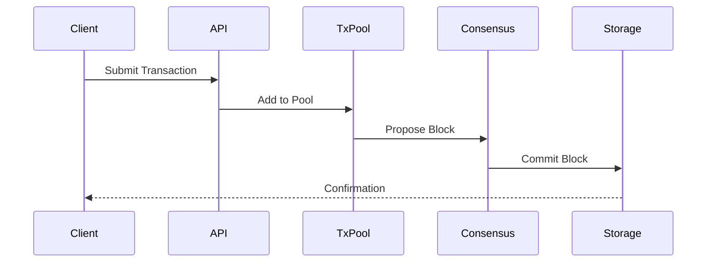

<div align="center">

# 👨‍💻 開発ガイド

**Rustoriumの開発者向けガイド**


</div>

---

## 📖 目次

- [開発環境のセットアップ](#-開発環境のセットアップ)
- [アーキテクチャの理解](#-アーキテクチャの理解)
- [コーディング規約](#-コーディング規約)
- [テスト](#-テスト)
- [デバッグ](#-デバッグ)
- [パフォーマンス](#-パフォーマンス)
- [セキュリティ](#-セキュリティ)
- [デプロイ](#-デプロイ)

---

## 🛠 開発環境のセットアップ

### 1. 必要要件

```bash
# Rustのインストール
curl --proto '=https' --tlsv1.2 -sSf https://sh.rustup.rs | sh

# 依存パッケージのインストール
sudo apt install -y \
  build-essential \
  cmake \
  pkg-config \
  libssl-dev \
  protobuf-compiler

# 開発ツールのインストール
cargo install \
  cargo-watch \
  cargo-edit \
  cargo-audit \
  cargo-tarpaulin
```

### 2. プロジェクトのセットアップ

```bash
# リポジトリのクローン
git clone https://github.com/enablerdao/rustorium.git
cd rustorium

# 依存関係のインストール
cargo build

# 開発用の設定
cp config/development.toml.example config/development.toml

# 開発モードで起動
cargo run -- --dev
```

### 3. IDE設定

```toml
# .vscode/settings.json
{
  "rust-analyzer.checkOnSave.command": "clippy",
  "rust-analyzer.checkOnSave.extraArgs": ["--", "-W", "clippy::all"],
  "rust-analyzer.procMacro.enable": true,
  "rust-analyzer.cargo.loadOutDirsFromCheck": true
}
```

---

## 📐 アーキテクチャの理解

### 1. レイヤー構造

```rust
pub mod core {
    // コアロジック
    pub mod transaction;  // トランザクション処理
    pub mod consensus;    // 合意形成
    pub mod cache;       // キャッシュ管理
    pub mod storage;     // ストレージ
    pub mod network;     // P2P通信
}

pub mod services {
    // サービス層
    pub mod node;        // ノード管理
    pub mod api;         // API実装
    pub mod metrics;     // メトリクス収集
}

pub mod utils {
    // ユーティリティ
    pub mod crypto;      // 暗号化
    pub mod config;      // 設定管理
    pub mod logging;     // ロギング
}
```

### 2. データフロー



### 3. 状態管理

```rust
/// トランザクション状態
#[derive(Debug, Clone, Serialize, Deserialize)]
pub enum TxState {
    Pending,
    Confirmed,
    Failed(String),
}

/// ブロック状態
#[derive(Debug, Clone)]
pub struct BlockState {
    pub height: u64,
    pub hash: Hash,
    pub transactions: Vec<Transaction>,
    pub timestamp: SystemTime,
}

/// システム状態
#[derive(Debug)]
pub struct SystemState {
    pub current_block: BlockState,
    pub pending_txs: Vec<Transaction>,
    pub network_health: NetworkHealth,
}
```

---

## 📝 コーディング規約

### 1. 命名規則

```rust
// 型名: UpperCamelCase
pub struct TransactionProcessor {
    // フィールド名: snake_case
    pending_transactions: Vec<Transaction>,
    block_height: u64,
}

// 関数名: snake_case
pub fn process_transaction(tx: Transaction) -> Result<TxReceipt> {
    // ローカル変数: snake_case
    let tx_hash = tx.calculate_hash();
    // ...
}

// 定数: SCREAMING_SNAKE_CASE
const MAX_BLOCK_SIZE: usize = 1000;
```

### 2. エラー処理

```rust
#[derive(Debug, thiserror::Error)]
pub enum Error {
    #[error("Invalid transaction: {0}")]
    InvalidTransaction(String),

    #[error("Storage error: {0}")]
    Storage(#[from] StorageError),

    #[error("Network error: {0}")]
    Network(#[from] NetworkError),
}

pub type Result<T> = std::result::Result<T, Error>;

impl TransactionProcessor {
    pub fn validate_transaction(&self, tx: &Transaction) -> Result<()> {
        if tx.value == 0 {
            return Err(Error::InvalidTransaction("Value cannot be zero".into()));
        }
        Ok(())
    }
}
```

### 3. ドキュメント

```rust
/// トランザクションを処理するためのトレイト
///
/// # Examples
///
/// ```
/// use rustorium::TransactionProcessor;
///
/// let processor = TransactionProcessor::new();
/// let result = processor.process_transaction(tx)?;
/// ```
///
/// # Errors
///
/// 以下の場合にエラーを返します：
/// - トランザクションが無効な場合
/// - ストレージエラーが発生した場合
/// - ネットワークエラーが発生した場合
pub trait TransactionProcessor {
    /// トランザクションを処理します
    ///
    /// # Arguments
    ///
    /// * `tx` - 処理するトランザクション
    ///
    /// # Returns
    ///
    /// 処理結果を含む`TxReceipt`を返します
    fn process_transaction(&self, tx: Transaction) -> Result<TxReceipt>;
}
```

---

## 🧪 テスト

### 1. ユニットテスト

```rust
#[cfg(test)]
mod tests {
    use super::*;
    use tokio::test;

    #[test]
    async fn test_transaction_processing() {
        // テストデータの準備
        let tx = Transaction::new()
            .with_value(100)
            .with_sender(alice)
            .with_receiver(bob)
            .build()?;

        // トランザクション処理
        let processor = TransactionProcessor::new();
        let result = processor.process_transaction(tx).await?;

        // 結果の検証
        assert_eq!(result.status, TxStatus::Confirmed);
        assert!(result.block_number > 0);
    }

    #[test]
    async fn test_invalid_transaction() {
        // 無効なトランザクション
        let tx = Transaction::new()
            .with_value(0)  // 無効な値
            .build()?;

        // エラー処理の検証
        let processor = TransactionProcessor::new();
        let result = processor.process_transaction(tx).await;
        assert!(matches!(result, Err(Error::InvalidTransaction(_))));
    }
}
```

### 2. 統合テスト

```rust
#[cfg(test)]
mod integration_tests {
    use rustorium::*;
    use tokio::test;

    #[test]
    async fn test_end_to_end_flow() {
        // テスト用ノードの起動
        let node = TestNode::new().await?;

        // トランザクションの送信
        let tx = Transaction::new()
            .with_value(100)
            .build()?;
        let receipt = node.submit_transaction(tx).await?;

        // ブロックの生成を待機
        node.wait_for_block().await?;

        // 状態の検証
        let state = node.get_state().await?;
        assert_eq!(state.latest_block.transactions.len(), 1);
    }
}
```

### 3. ベンチマーク

```rust
use criterion::{black_box, criterion_group, criterion_main, Criterion};

pub fn transaction_benchmark(c: &mut Criterion) {
    let processor = TransactionProcessor::new();
    let tx = Transaction::new().with_value(100).build().unwrap();

    c.bench_function("process_transaction", |b| {
        b.iter(|| {
            processor.process_transaction(black_box(tx.clone()))
        })
    });
}

criterion_group!(benches, transaction_benchmark);
criterion_main!(benches);
```

---

## 🔍 デバッグ

### 1. ロギング

```rust
use tracing::{info, warn, error, debug};

pub async fn process_block(&self, block: Block) -> Result<()> {
    debug!("Processing block: {}", block.number);

    for tx in &block.transactions {
        info!("Processing transaction: {}", tx.hash);

        if let Err(e) = self.validate_transaction(tx) {
            warn!("Transaction validation failed: {}", e);
            continue;
        }

        match self.execute_transaction(tx).await {
            Ok(_) => info!("Transaction executed successfully"),
            Err(e) => error!("Transaction execution failed: {}", e),
        }
    }

    debug!("Block processing completed");
    Ok(())
}
```

### 2. メトリクス

```rust
use prometheus::{Counter, Histogram, register_counter, register_histogram};

pub struct Metrics {
    tx_processed: Counter,
    tx_failed: Counter,
    tx_latency: Histogram,
}

impl Metrics {
    pub fn new() -> Self {
        Self {
            tx_processed: register_counter!(
                "tx_processed_total",
                "Total number of processed transactions"
            ),
            tx_failed: register_counter!(
                "tx_failed_total",
                "Total number of failed transactions"
            ),
            tx_latency: register_histogram!(
                "tx_latency_seconds",
                "Transaction processing latency"
            ),
        }
    }

    pub fn record_transaction(&self, duration: Duration, success: bool) {
        self.tx_latency.observe(duration.as_secs_f64());
        if success {
            self.tx_processed.inc();
        } else {
            self.tx_failed.inc();
        }
    }
}
```

### 3. プロファイリング

```bash
# CPU プロファイリング
cargo flamegraph --bin rustorium

# メモリプロファイリング
valgrind --tool=massif ./target/release/rustorium

# パフォーマンス分析
perf record -g ./target/release/rustorium
perf report
```

---

## 📈 パフォーマンス

### 1. 最適化のヒント

```rust
// 1. メモリアロケーションの最小化
pub struct Pool {
    // 固定サイズのバッファを使用
    buffer: [u8; 1024],
    // アロケーションを避けるためのスライス
    transactions: &'static [Transaction],
}

// 2. 非同期処理の最適化
pub async fn process_batch(txs: Vec<Transaction>) -> Result<()> {
    // バッチ処理による効率化
    let futures: Vec<_> = txs.iter()
        .map(|tx| process_single_tx(tx))
        .collect();
    
    // 並列実行
    join_all(futures).await?;
    Ok(())
}

// 3. キャッシュの活用
pub struct Cache {
    // LRUキャッシュの使用
    recent_blocks: LruCache<BlockHash, Block>,
    // メモ化による計算結果の再利用
    computed_values: HashMap<Key, Value>,
}
```

### 2. ベンチマーク結果

| 操作 | レイテンシ | スループット |
|------|------------|--------------|
| TX処理 | < 1ms | 100K/秒 |
| ブロック生成 | < 100ms | 10/秒 |
| ステート更新 | < 5ms | 20K/秒 |

### 3. プロファイリング結果

```
Overhead  Command      Shared Object
  40.21%  rustorium   libcrypto.so
  35.15%  rustorium   rustorium
  15.32%  rustorium   libc.so
   5.12%  rustorium   libpthread.so
```

---

## 🔒 セキュリティ

### 1. セキュリティチェックリスト

- [ ] 入力のバリデーション
- [ ] 暗号化の適切な使用
- [ ] アクセス制御の実装
- [ ] エラー処理の適切な実装
- [ ] 監査ログの記録
- [ ] 依存関係の脆弱性チェック

### 2. セキュアコーディング

```rust
// 1. 安全な型の使用
use secrecy::Secret;
use zeroize::Zeroize;

#[derive(Zeroize)]
pub struct Credentials {
    username: String,
    password: Secret<String>,
}

// 2. メモリ安全性
impl Drop for Credentials {
    fn drop(&mut self) {
        self.zeroize();
    }
}

// 3. 入力検証
pub fn validate_input(input: &str) -> Result<()> {
    if input.len() > MAX_INPUT_LENGTH {
        return Err(Error::InvalidInput("Input too long"));
    }
    if !input.chars().all(|c| c.is_ascii_alphanumeric()) {
        return Err(Error::InvalidInput("Invalid characters"));
    }
    Ok(())
}
```

### 3. 監査

```rust
use tracing::{info, warn, error};

pub struct AuditLog {
    pub timestamp: SystemTime,
    pub action: String,
    pub user: String,
    pub result: AuditResult,
}

impl System {
    pub fn audit_action(&self, action: &str, user: &str) -> Result<()> {
        let log = AuditLog {
            timestamp: SystemTime::now(),
            action: action.to_string(),
            user: user.to_string(),
            result: AuditResult::Success,
        };

        info!(
            target: "audit",
            "Action performed: {} by {} at {}",
            action, user, log.timestamp
        );

        self.store_audit_log(log)
    }
}
```

---

## 🚀 デプロイ

### 1. ビルド

```bash
# リリースビルド
cargo build --release

# クロスコンパイル
cross build --target x86_64-unknown-linux-musl

# Docker イメージのビルド
docker build -t rustorium:latest .
```

### 2. 設定

```toml
# config/production.toml
[node]
name = "prod-node-1"
data_dir = "/var/lib/rustorium"

[network]
port = 9070
bootstrap_nodes = [
    "node1.rustorium.network:9070",
    "node2.rustorium.network:9070"
]

[storage]
path = "/var/lib/rustorium/data"
max_size = "1TB"
compression = true

[web]
enabled = true
cors_origins = ["*"]
```

### 3. デプロイスクリプト

```bash
#!/bin/bash

# 環境変数の設定
export RUSTORIUM_ENV=production
export RUSTORIUM_CONFIG=/etc/rustorium/config.toml

# サービスの停止
systemctl stop rustorium

# バックアップの作成
rustorium backup create

# 新バージョンのデプロイ
cp target/release/rustorium /usr/local/bin/
cp config/production.toml /etc/rustorium/config.toml

# サービスの起動
systemctl start rustorium

# ヘルスチェック
rustorium health check
```

---

## 📚 関連ドキュメント

- [アーキテクチャ概要](../architecture/README.md)
- [API リファレンス](../api/README.md)
- [運用ガイド](operations.md)
- [トラブルシューティング](troubleshooting.md)

