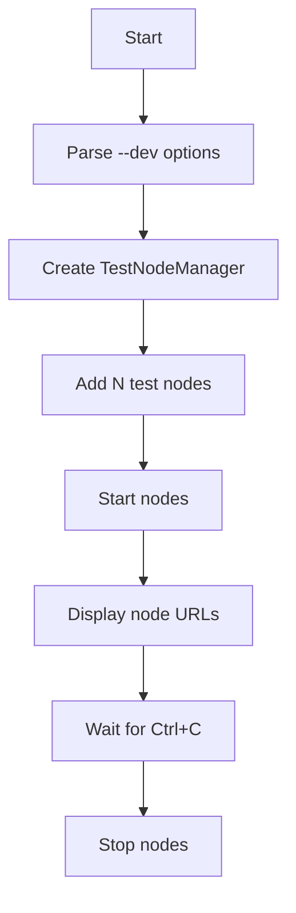
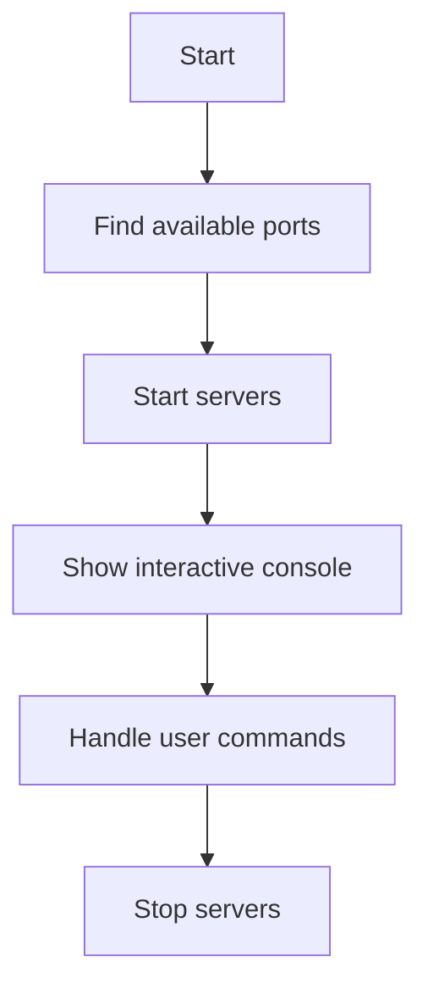

# Rustorium Project Structure

## Overview

Rustorium is a modular blockchain platform built in Rust, featuring:
- DAG-based transaction processing
- Avalanche consensus protocol
- Dynamic sharding
- P2P networking with libp2p
- Multi-language support
- Development tools for testing

## Directory Structure

```
rustorium/
├── src/
│   ├── cli/                    # CLI and interactive console
│   │   ├── console.rs          # Interactive console UI
│   │   ├── help.rs            # Help message display
│   │   ├── options.rs         # Command-line options
│   │   ├── server.rs          # Server management
│   │   └── mod.rs             # CLI module entry point
│   │
│   ├── core/                   # Core blockchain components
│   │   ├── dag.rs             # DAG implementation
│   │   ├── avalanche.rs       # Consensus protocol
│   │   ├── sharding.rs        # Sharding management
│   │   ├── engine.rs          # Blockchain engine
│   │   └── storage/           # Storage layer
│   │       ├── rocksdb.rs     # RocksDB implementation
│   │       ├── shard.rs       # Shard state storage
│   │       └── mod.rs         # Storage traits
│   │
│   ├── network/                # P2P networking
│   │   ├── p2p.rs             # libp2p implementation
│   │   ├── types.rs           # Network message types
│   │   └── mod.rs             # Network module entry
│   │
│   ├── dev/                    # Development tools
│   │   └── mod.rs             # Test node management
│   │
│   ├── i18n/                   # Internationalization
│   │   └── mod.rs             # Language support
│   │
│   └── main.rs                 # Application entry point
│
├── api/                        # API server
├── frontend/                   # Frontend application
└── docs/                       # Documentation
```

## Component Interaction

### 1. Startup Flow
1. Parse command-line options (`cli/options.rs`)
2. Set up logging and configuration
3. Choose operation mode:
   - Development mode: Start test nodes
   - Normal mode: Start API and frontend servers

### 2. Development Mode


### 3. Normal Mode


### 4. Server Components
- **API Server**: Handles blockchain operations
  - Port: Auto-selected from 8001, 3001, 5001, etc.
  - Environment: `PORT` variable for configuration

- **Frontend Server**: User interface
  - Port: Auto-selected from 8000, 3000, 5000, etc.
  - Environment: `PORT` variable for configuration

### 5. Core Components

#### DAG Engine
- Manages transaction graph
- Handles dependencies
- Schedules parallel execution

#### Avalanche Protocol
- Sampling-based voting
- Confidence tracking
- Metastability detection

#### Sharding Manager
- Dynamic shard allocation
- Cross-shard transactions
- State synchronization

#### P2P Network
- libp2p-based networking
- Gossipsub for messages
- Kademlia for peer discovery

## Usage Examples

### 1. Development Mode
```bash
# Start 10 test nodes
cargo run -- --dev

# Custom configuration
cargo run -- --dev --nodes 5 --base-port 50000 --data-dir /path/to/data
```

### 2. Server Options
```bash
# Start API server only
cargo run -- --api-only

# Start frontend only
cargo run -- --frontend-only

# Fast development mode
cargo run -- --fast

# Release mode
cargo run -- --release
```

### 3. Port Configuration
```bash
# Specify ports manually
cargo run -- --api-port 8001 --frontend-port 8000

# Auto port selection (default)
cargo run
```

## Development Tools

### Test Node Features
- Multiple node instances
- Automatic peer discovery
- Individual data directories
- Separate API and Frontend endpoints
- Automatic port allocation

### Port Allocation
Each node gets three consecutive ports:
```
Node 1: base_port,     base_port+1,     base_port+2
Node 2: base_port+3,   base_port+4,     base_port+5
Node 3: base_port+6,   base_port+7,     base_port+8
...
```

### Node Information Display
Each node shows:
- API URL: `http://localhost:<port>`
- Frontend URL: `http://localhost:<port>`
- P2P address: `/ip4/127.0.0.1/tcp/<port>`
- Peer ID

## Internationalization

Supported languages:
- English (en)
- Japanese (ja)
- Chinese (zh)
- Korean (ko)

Language selection is available through the interactive console.

## Storage Layer

### RocksDB Implementation
- Column families for data separation
- Snappy compression
- Atomic batch operations
- Type-safe storage traits

### Sharding
- Shard state management
- Cross-shard transaction handling
- State synchronization
- Load balancing

## Contributing

See [CONTRIBUTING.md](contributing.md) for:
- Development setup
- Coding guidelines
- Testing instructions
- Pull request process