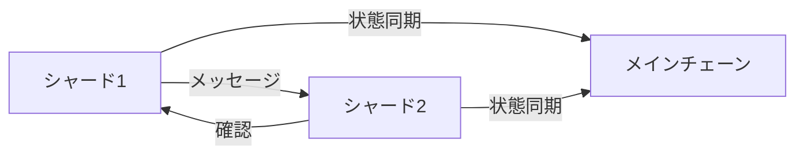
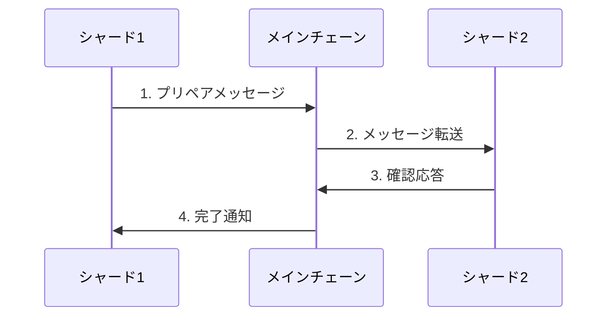
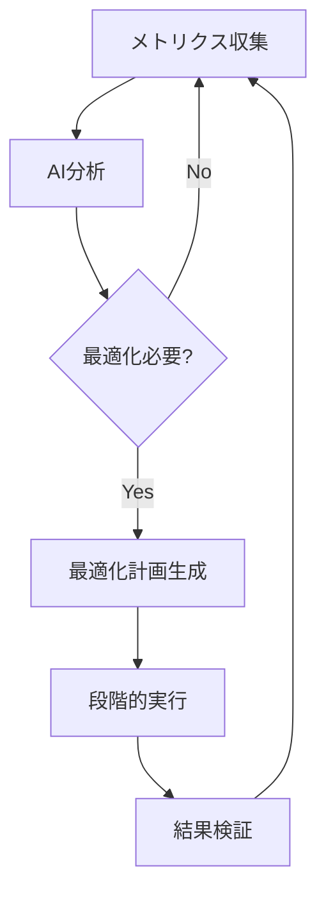
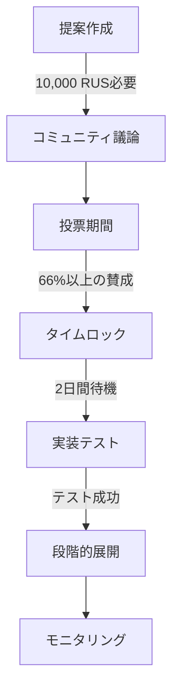

# 🔄 シャーディングシステム

## 💫 概要

Rustoriumは、次世代の動的シャーディングシステムを採用し、ネットワークの需要に応じて自動的にスケーリングを行います。

### ✨ 主な特徴
- **無限のスケーラビリティ**: 需要に応じて自動的にシャードを生成
- **スマートな負荷分散**: AIによる最適なリソース配分
- **超軽量な通信**: 効率的なクロスシャード通信
- **自己修復**: 自動的な障害検知と回復

## 🏗️ アーキテクチャ

### 1. シャードの構造
シャードは、独立した処理ユニットとして機能し、以下の特徴を持ちます：
- **🔐 独自のステート**: 分離されたステート管理
- **👥 専用バリデーター**: 高性能な検証ノード群
- **🔄 クロスシャード通信**: 効率的なメッセージング
- **📊 動的リソース**: AIベースの最適化

### 2. アドレスシステム
```rust
// 基本形式
sh{shard_id}-{account_id}-{checksum}

// 例
sh1-7f9c8d6e5a4b3c2d1e-a1b2  // 標準アドレス
sh1.2-7f9c8d6e5a4b3c2d1e-a1b2  // サブシャードアドレス
```

### 3. シャード間通信


## 🎮 シャード管理

### 1. 自動スケーリング条件

#### 📊 パフォーマンスベース
```rust
struct PerformanceMetrics {
    tps_current: u32,        // 現在のTPS
    tps_threshold: u32,      // 閾値: 80%
    memory_usage: f64,       // メモリ使用率
    memory_threshold: f64,   // 閾値: 80%
    account_count: u32,      // アカウント数
    account_limit: u32,      // 上限: 1,000,000
}
```

#### 💎 経済指標ベース
```rust
struct EconomicMetrics {
    total_value: U256,      // 総資産額
    value_threshold: U256,  // 閾値: 1,000,000 RUS
    contract_usage: f64,    // コントラクト使用率
    cross_shard_ratio: f64, // クロスシャード比率
}
```

### 2. シャード設定
```rust
pub struct ShardConfig {
    // 🎯 基本パラメータ
    pub performance: PerformanceConfig {
        max_tps: u32,          // 10,000 TPS
        max_accounts: u32,     // 1,000,000
        max_storage: u64,      // 1 TB
    },

    // 📈 スケーリング設定
    pub scaling: ScalingConfig {
        threshold: f64,        // 0.8 (80%)
        min_validators: u32,   // 4
        optimal_size: u64,     // 100 GB
    },

    // 🔄 最適化設定
    pub optimization: OptimizationConfig {
        rebalance_interval: Duration,
        ai_prediction_window: Duration,
    }
}
```

## 🛡️ バリデーター要件

### 1. 参加要件
```rust
struct ValidatorRequirements {
    // 💰 経済的要件
    min_stake: U256,           // 100,000 RUS
    lock_period: Duration,     // 30日間
    
    // 🖥️ 技術要件
    min_uptime: f64,          // 99.9%
    max_latency: Duration,    // 100ms
    min_storage: u64,         // 1TB
    
    // 🔒 セキュリティ要件
    security_deposit: U256,   // 追加保証金
    kyc_level: u8,           // KYCレベル
}
```

### 2. インセンティブシステム
```rust
pub struct ValidatorIncentives {
    // 💎 報酬システム
    rewards: RewardConfig {
        base_rate: f64,           // 10% APY
        performance_bonus: f64,    // 最大5%追加
        cross_shard_bonus: f64,    // 取引量に応じて
    },

    // ⚠️ ペナルティシステム
    penalties: PenaltyConfig {
        offline: PenaltyRate {
            threshold: Duration,   // 1時間
            rate: f64,            // -1%/時間
        },
        misbehavior: PenaltyRate {
            threshold: u32,       // 違反回数
            rate: f64,            // -20%/違反
        },
        performance: PenaltyRate {
            threshold: Duration,  // レイテンシ閾値
            rate: f64,           // -0.1%/ms
        }
    }
}
```

## 🔄 クロスシャード通信

### 1. 通信プロトコル


### 2. メッセージングシステム
```rust
pub struct CrossShardMessage {
    // 📍 ルーティング情報
    routing: MessageRouting {
        from_shard: ShardId,
        to_shard: ShardId,
        priority: Priority,     // HIGH/MEDIUM/LOW
    },

    // 📦 ペイロード
    payload: MessagePayload {
        data: Vec<u8>,
        size: usize,
        checksum: [u8; 32],
    },

    // 📊 メタデータ
    metadata: MessageMetadata {
        timestamp: Timestamp,
        ttl: Duration,
        retry_count: u8,
    }
}

impl CrossShardMessage {
    // ✨ スマート送信
    pub async fn smart_send(&self) -> Result<MessageReceipt> {
        // 1. 最適ルート選択
        let route = self.find_optimal_route()?;
        
        // 2. 2段階コミット
        self.prepare(route).await?;
        self.commit(route).await?;
        
        // 3. 確認と再試行
        self.verify_and_retry().await?;
        
        Ok(MessageReceipt::new())
    }
    
    // 🔄 非同期処理
    pub async fn process(&self) -> Result<()> {
        match self.routing.priority {
            Priority::HIGH => {
                // 即時処理
                self.process_immediately().await
            },
            Priority::MEDIUM => {
                // バッチ処理
                self.process_in_batch().await
            },
            Priority::LOW => {
                // バックグラウンド処理
                self.process_background().await
            }
        }
    }
}
```

## 🎯 シャードの最適化

### 1. AIベース負荷分散
```rust
pub struct LoadBalancer {
    // 🤖 AI予測モデル
    predictor: AIPredictor {
        model_type: ModelType,      // LSTM/GRU/Transformer
        window_size: Duration,      // 予測ウィンドウ
        confidence: f64,            // 予測信頼度
    },

    // 📊 負荷メトリクス
    metrics: LoadMetrics {
        current_load: f64,          // 現在の負荷
        predicted_load: f64,        // 予測負荷
        threshold: f64,             // 閾値
    },

    // 🔄 最適化戦略
    strategy: OptimizationStrategy {
        rebalance_interval: Duration,  // 再分散間隔
        migration_cost: Cost,          // 移行コスト
        priority_rules: Vec<Rule>,     // 優先ルール
    }
}
```

### 2. パフォーマンスモニタリング
```rust
pub struct ShardMetrics {
    // 📈 基本メトリクス
    performance: PerformanceMetrics {
        tps: u32,                // 現在のTPS
        latency: Duration,       // 平均レイテンシ
        storage: StorageMetrics, // ストレージ使用状況
    },
    
    // 🔍 詳細メトリクス
    advanced: AdvancedMetrics {
        cross_shard_ratio: f64,  // クロスシャード比率
        validator_stats: Vec<ValidatorMetric>,
        resource_usage: ResourceMetrics,
    },

    // 📊 予測メトリクス
    predictions: PredictionMetrics {
        expected_load: f64,      // 予想負荷
        growth_rate: f64,        // 成長率
        bottlenecks: Vec<Bottleneck>,
    }
}
```

### 3. 自動最適化フロー

```

## 🏛️ ガバナンスとアップグレード

### 1. パラメータガバナンス
```solidity
// ガバナンスコントラクト
contract ShardGovernance {
    // 📊 システムパラメータ
    struct SystemParams {
        uint256 maxTps;
        uint256 maxAccounts;
        uint256 scalingThreshold;
        uint256 minValidators;
    }

    // 🗳️ 投票システム
    struct Proposal {
        bytes32 id;
        SystemParams params;
        uint256 votingEnds;
        uint256 yesVotes;
        uint256 noVotes;
        bool executed;
    }

    // 🔒 タイムロック
    uint256 public constant TIMELOCK = 2 days;
    
    // 提案作成（10,000 RUS以上の保有者）
    function propose(SystemParams calldata params)
        external
        onlyTokenHolder(10000 * 1e18)
    {
        // 提案作成ロジック
    }
    
    // 投票（ステーク量に応じた投票力）
    function vote(bytes32 proposalId, bool support)
        external
        onlyStaker
    {
        // 投票ロジック
    }
    
    // 実行（タイムロック後）
    function execute(bytes32 proposalId)
        external
        afterTimelock
    {
        // 実行ロジック
    }
}
```

### 2. アップグレードプロセス


### 3. モニタリングシステム
```rust
pub struct UpgradeMonitor {
    // 📊 アップグレードメトリクス
    metrics: UpgradeMetrics {
        success_rate: f64,      // 成功率
        error_rate: f64,        // エラー率
        rollback_count: u32,    // ロールバック数
    },

    // 🚨 アラートシステム
    alerts: AlertSystem {
        error_threshold: f64,   // エラー閾値
        notify_list: Vec<Contact>,
        auto_rollback: bool,    // 自動ロールバック
    },

    // 📈 パフォーマンス比較
    comparison: PerformanceComparison {
        before: SystemMetrics,
        after: SystemMetrics,
        delta: MetricsDelta,
    }
}
```

## 🚀 将来の展望

### 1. 適応型アーキテクチャ
- **🤖 AIによる完全自動化**
  ```rust
  pub struct AIController {
      predictor: LoadPredictor,
      optimizer: ResourceOptimizer,
      learner: ExperienceLearner,
  }
  ```

### 2. 高度な最適化
- **⚡️ ゼロ知識シャーディング**
  ```rust
  pub struct ZKSharding {
      prover: ZKProver,
      verifier: ZKVerifier,
      aggregator: ProofAggregator,
  }
  ```

### 3. エコシステム拡張
- **🌐 クロスチェーン統合**
  ```rust
  pub struct ChainBridge {
      protocols: Vec<Protocol>,
      adapters: Vec<Adapter>,
      router: MessageRouter,
  }
  ```

---

<div align="center">

**[📚 API仕様書](../api/reference.md)** | **[💻 実装例](../examples/)** | **[🤝 コントリビューション](../contributing.md)**

</div>